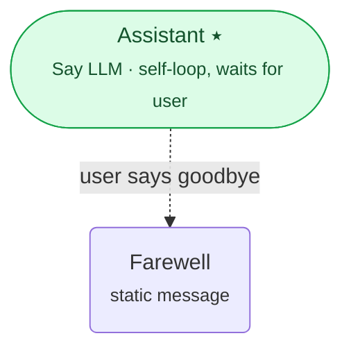

# Interactly Workflow SDK

A Python SDK for the Interactly Workflow API. It lets you **author, deploy, run, and operate**
AI conversational workflows entirely as code — the same workflows you would otherwise build in the
dashboard, expressed as typed Python config objects and driven through a typed client.

- **Author** workflows from typed config classes (nodes, edges, tools, LLM configs, super-nodes, …).
- **Deploy** them to the Interactly Workflow API (create workflows, versions, publish, clone, export/import).
- **Run** them interactively (streaming events over WebSocket, or turn-by-turn `execute`).
- **Operate** them (runs, evaluations, comments, schedules, webhooks, simulations, global variables).

---

## Where to start

| If you want to… | Go to |
|---|---|
| **Learn the SDK step by step** (recommended) | [`wf_examples/README.md`](wf_examples/README.md) — a 25-step **progressive curriculum**, each step with a workflow diagram and a runnable notebook |
| Understand what the SDK is and read a guided tour | [`docs/`](docs/) — start at [`docs/README.md`](docs/README.md) |
| Run interactive, executable lessons | [`notebooks/`](notebooks/) — start at `00_index.ipynb` |
| Look up a method signature | [`docs/api_async.md`](docs/api_async.md) (async) · [`docs/api_sync.md`](docs/api_sync.md) (sync) |
| Run work in the background while the caller talks | [`docs/guides/companion_threads.md`](docs/guides/companion_threads.md) |
| Replay a finished run from any turn | [`docs/guides/reruns.md`](docs/guides/reruns.md) |

---

## Install & set up

This is a **self-contained** package — everything it needs lives inside this folder, and nothing
outside it is required. Snippets, notebooks, and examples read like any published library —
`import interactly` / `import interactly_configs`, with **no `sys.path` hacks** once installed.

**Option A — one command (recommended).** Build a virtualenv from the pinned `Pipfile` (Python 3.13):

```bash
pipenv install --dev --python 3.13     # or: make install
```

> **Use `--dev`.** The `[dev-packages]` group provides `ipykernel`, `nbclient`, and `nbformat`, which
> are required to run/verify the notebooks. A plain `pipenv install` (runtime deps only) is enough to
> *use* the SDK from your own code, but the notebooks won't execute without `--dev`.

Then run any command inside the environment with `pipenv run …` (e.g. `pipenv run python notebooks/_run_e2e.py`),
or open a shell in it with `pipenv shell`. To create the virtualenv *inside* this folder instead of
pipenv's default location, prefix the install with `PIPENV_VENV_IN_PROJECT=1`.

**Option B — editable install into your own environment:**

```bash
pip install -e . -e ./configs      # makes `interactly` + `interactly_configs` importable anywhere
```

Prefer not to install at all? The notebooks (`import _bootstrap`) and examples (`import _shared_sdk`)
add this folder's `src/` and `configs/src/` to `sys.path` for you, so they run straight from the repo.

Set your credentials as environment variables (never hardcode them) — or place them in a `.env` file in
this folder, which the notebooks and examples load automatically:

```bash
export INTERACTLY_API_KEY="…"
export INTERACTLY_BASE_URL="https://api-dev.interactly.ai/workflows"   # or your instance
export INTERACTLY_TEAM_ID="…"
export INTERACTLY_USER_ID="…"
```

### How to find your credentials

Throughout, replace the `-dev` hosts below with your own Interactly instance if different (e.g.
`https://dashboard.interactly.ai` and `https://api.interactly.ai`).

**`INTERACTLY_BASE_URL`** — the Workflow API base URL for your instance, e.g.
`https://api-dev.interactly.ai/workflows`.

**`INTERACTLY_API_KEY`** — either of:
- **An API token** (recommended for long-lived use). Create one in the dashboard at
  **`<your-dashboard-url>/api-keys`** — for the dev instance: <https://dashboard-dev.interactly.ai/api-keys>.
- **The bearer token** from your browser session. Open the dashboard, then Chrome DevTools
  (**Inspect → Network**), refresh, click any request to the API, and copy the value of the
  `Authorization: Bearer <token>` request header (without the `Bearer ` prefix). Session tokens are
  short-lived, so prefer an API token for anything beyond a quick test.

**`INTERACTLY_TEAM_ID`** and **`INTERACTLY_USER_ID`** — read them from your own user record:

1. Log in to the dashboard and open the **Workflows** page: `<your-dashboard-url>/workflows`
   (dev: <https://dashboard-dev.interactly.ai/workflows>).
2. Open Chrome DevTools → **Inspect → Network**, then **refresh** the page.
3. Find the request **`GET .../accounts/v1/users/me`** (e.g.
   `https://api-dev.interactly.ai/accounts/v1/users/me`, Status `200`) and open its **Response**.
4. The JSON response contains both IDs:

   ```jsonc
   {
     "message": "User fetched successfully",
     "user": {
       "teamId": "67458e762b7d3dc15aaea5b5",   // → INTERACTLY_TEAM_ID
       "id": "687b1a4f745c8e6806c98d91",        // → INTERACTLY_USER_ID
       "firstName": "…",
       "email": "…"
     }
   }
   ```

   Use `user.teamId` for `INTERACTLY_TEAM_ID` and `user.id` for `INTERACTLY_USER_ID`.

> Tip: the same `users/me` request header also carries the `Authorization: Bearer …` token described
> above, so you can grab all three values from that one network call.

### Verify your setup

Running the notebooks is the fastest end-to-end check that the SDK works against your instance.
This executes every lesson and example notebook headlessly and reports PASS/FAIL:

```bash
pipenv run python notebooks/_run_e2e.py                       # run all notebooks
pipenv run python notebooks/_run_e2e.py wf_example_progression_1   # or a single one
```

It loads credentials from `.env` automatically, so no extra exports are needed.

---

## Hello, workflow

The **async client is the preferred way to use the SDK** (workflows are I/O-bound). `async with`
opens and cleanly closes it:

```python
import asyncio
from interactly import AsyncWorkflowClient, WorkflowCommand

async def main():
    async with AsyncWorkflowClient() as client:   # reads INTERACTLY_* env vars
        # 1. Create a workflow and an active version
        wf = await client.workflows.create(name="Hello World Workflow")
        await client.workflows.versions.create(wf.id, version_name="v1", mark_as_active=True)

        # 2. List workflows (auto-paginate)
        page = await client.workflows.list(size=50)
        print(f"Team has {len(await page.list_all())} workflows")

        # 3. Stream a run
        async with client.runs.stream(workflow_id=wf.id, command=WorkflowCommand.START) as events:
            async for event in events:
                print(event.type, event.output)
                if event.is_terminal():
                    break

        # 4. Clean up
        await client.workflows.delete(wf.id)

asyncio.run(main())
```

Prefer a plain script? The synchronous `WorkflowClient` mirrors every call (drop the `await`, use
`with`, and a normal `for`). For **authoring workflows as typed configs** and running them through a
server-backed handle, see [`wf_examples/`](wf_examples/) and
[`docs/04_first_workflow.md`](docs/04_first_workflow.md).

---

## Build a workflow from typed configs

Workflows are authored as a graph of **nodes** joined by **edges**. Here is a minimal but complete
two-node workflow (adapted from [`notebooks/01_quickstart.ipynb`](notebooks/01_quickstart.ipynb)):

- an **LLM node** that is the **start** node — it `self_loop`s and `wait_for_user_message`s, so it
  keeps chatting with the user turn after turn, and
- a **static "say" node** that emits a fixed goodbye and ends the run,
- linked by a **conditional edge** that fires only when the user says goodbye.



```python
import asyncio

from interactly import AsyncWorkflowClient
from interactly.configs import (
    ConditionConfig,
    ConditionalEdgeConfig,
    OPENAIModel,
    OpenAILLMConfig,
    PromptConfig,
    SayLLMNodeConfig,
    SayStaticMessageNodeConfig,
    StaticMessagesConfig,
    WorkflowConfig,
    WorkflowConfigFullyHydrated,
)

# 1) START node — an LLM node that drives the conversation. Because it self-loops and
#    waits for the user, it keeps responding turn after turn until an edge takes over.
assistant_node = SayLLMNodeConfig(
    name="Assistant",
    is_start=True,
    self_loop=True,
    wait_for_user_message=True,
    main_response_config=PromptConfig(
        prompt="You are a friendly support assistant. Answer the user's questions concisely.",
    ),
    llms_config=OpenAILLMConfig(model=OPENAIModel.GPT_5_4_MINI, max_tokens=256),
)

# 2) END node — a static "say" node that emits a fixed message (no LLM call) and finishes.
farewell_node = SayStaticMessageNodeConfig(
    name="Farewell",
    static_messages_config=StaticMessagesConfig(
        static_messages=["Thanks for chatting — have a great day!"],
    ),
)

# 3) CONDITIONAL edge — leave the assistant only when its free-form condition is judged true.
#    While it is false the assistant keeps self-looping; when the user says goodbye, the run
#    moves to the farewell node and ends.
to_farewell = ConditionalEdgeConfig(
    name="End on goodbye",
    source_node_logical_id=assistant_node.logical_id,
    destination_node_logical_id=farewell_node.logical_id,
    condition=ConditionConfig(
        condition_freeform="Take this path only when the user says goodbye or asks to end the conversation.",
    ),
)

# 4) Assemble the fully-hydrated workflow (nodes + edges).
config = WorkflowConfigFullyHydrated(
    workflow_config=WorkflowConfig(name="Support Assistant"),
    node_configs=[assistant_node, farewell_node],
    edge_configs=[to_farewell],
)


async def main():
    async with AsyncWorkflowClient() as client:   # reads INTERACTLY_* env vars
        # create_from_config publishes a v0 version and marks it active, so it is runnable at once.
        workflow = await client.workflows.create_from_config(config)
        print(f"Created workflow {workflow.id} (start node: {assistant_node.name!r})")
        # Drive it interactively via client.workflows.handle(workflow.id) —
        # see notebooks/02_interactive_workflow.ipynb.

asyncio.run(main())
```

---

## Repository layout

```
workflow_sdk/
├── src/interactly/       # the SDK: client, resources, runtime, streaming, types
├── configs/              # vendored interactly_configs (the [configs] extra)
├── docs/                 # guided tour + per-feature guides + api reference
├── notebooks/            # runnable, comprehensive Jupyter lessons
├── wf_examples/          # workflow-authoring examples, simple → complex
└── tests/                # unit + integration tests
```

## Key concepts (one-minute version)

- A **workflow** is a directed graph of **nodes** (LLM turns, tools, HTTP calls, conversations, …)
  connected by **edges** (direct / conditional / companion). See [`docs/03_concepts.md`](docs/03_concepts.md).
- You **author** a `WorkflowConfigFullyHydrated` from typed config classes, then **upload** it. All
  execution state (session, history, node state) lives on the server; a `WorkflowHandle` is a thin
  client-side reference. See [`docs/runtime.md`](docs/runtime.md).
- The client comes in **sync** (`WorkflowClient`) and **async** (`AsyncWorkflowClient`) forms with
  identical surfaces. List endpoints return paginated `SyncPage` / `AsyncPage` objects.
- A run can carry **companion threads** — background threads that keep working while the main thread
  waits for the caller — and a finished run driven over WebSocket can be **re-run** from any turn.
  See [`docs/guides/companion_threads.md`](docs/guides/companion_threads.md) and
  [`docs/guides/reruns.md`](docs/guides/reruns.md).

## License

Proprietary — internal Interactly code, distributed to customers under their existing agreement.
Security policy in [`SECURITY.md`](SECURITY.md); contribution guide in
[`CONTRIBUTING.md`](CONTRIBUTING.md); release history in [`CHANGELOG.md`](CHANGELOG.md).
