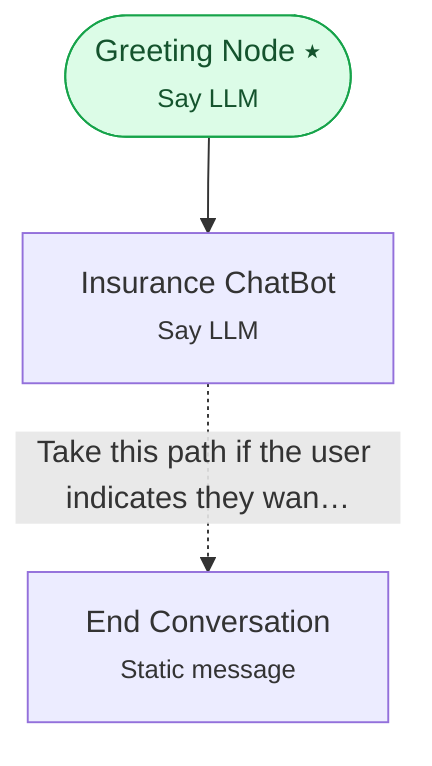

# Example 1 — Your first workflow

> **Progressive curriculum · step 1 of 23.** Build and run a minimal three-node conversational workflow end to end.

**Concepts introduced here:** `SayLLMNodeConfig`, `SayStaticMessageNodeConfig`, `DirectEdgeConfig`, `ConditionalEdgeConfig`, `PromptConfig`, `OpenAILLMConfig`, `WorkflowConfigFullyHydrated`

| | |
|---|---|
| **Workflow name** | Example 1: Insurance ChatBot |
| **Builder** | [`wf_example_progression_1.py`](./wf_example_progression_1.py) · `build_assistant_workflow()` |
| **Runnable notebook** | [`notebooks/wf_example_notebooks/wf_example_progression_1.ipynb`](../notebooks/wf_example_notebooks/wf_example_progression_1.ipynb) |
| **Nodes / edges** | 3 nodes, 2 edges |

## What it does

This workflow demonstrates a simple insurance chatbot that greets the user and provides helpful information about Cigna health insurance services.
It represents the foundational building block of conversational AI workflows, showcasing a basic structure with a greeting, a conversational assistant, and a natural conversation ending.

## Workflow diagram



*⭑ = start node · solid arrow = direct edge · dashed arrow = conditional edge (label = condition).*

## Nodes

| Node | Type | Role |
|---|---|---|
| Greeting Node | Say LLM | start |
| Insurance ChatBot | Say LLM | waits for user, self-loops |
| End Conversation | Static message | — |

## Routing

| From | To | Edge | Condition |
|---|---|---|---|
| Greeting Node | Insurance ChatBot | direct | — |
| Insurance ChatBot | End Conversation | conditional | `Take this path if the user indicates they want to end the conversation or says goodbye. E…` |

## Run it

```bash
# Interactive, capped notebook (recommended — no input() needed):
pipenv run python notebooks/_run_e2e.py wf_example_progression_1

# Or open the notebook:
#   notebooks/wf_example_notebooks/wf_example_progression_1.ipynb

# Or the original interactive script (reads turns from stdin):
pipenv run python wf_examples/wf_example_progression_1.py
```

---
— · [Curriculum index](./README.md) · [Example 2 →](./wf_example_progression_2.md)
