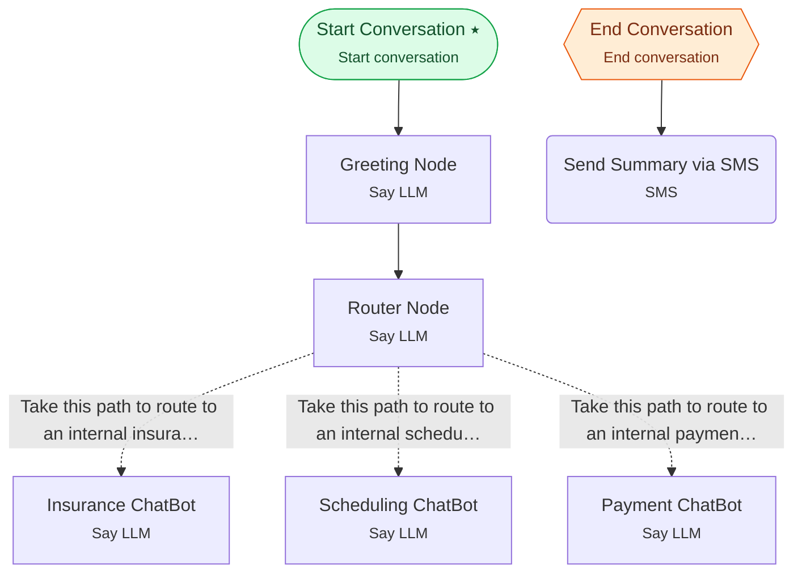

# Example 10 — Communication & transcript summary

> **Progressive curriculum · step 10 of 23.** End the call, summarise the transcript, and hand off to a (disabled) SMS node.

**Concepts introduced here:** `EndConversationNodeConfig`, `SendSMSNodeConfig`, dynamic-variable templating in nodes, transcript processing

| | |
|---|---|
| **Workflow name** | Example 10: Conversation with SMS Summary |
| **Builder** | [`wf_example_progression_10.py`](./wf_example_progression_10.py) · `build_assistant_workflow()` |
| **Runnable notebook** | [`notebooks/wf_example_notebooks/wf_example_progression_10.ipynb`](../notebooks/wf_example_notebooks/wf_example_progression_10.ipynb) |
| **Nodes / edges** | 8 nodes, 6 edges |

## What it does

This workflow introduces conversation lifecycle management through specialized nodes that bookend conversations with explicit start and end actions.
It demonstrates Start Conversation Node (which configures conversation parameters like voice mode), End Conversation Node (which processes the entire conversation transcript), and Send SMS Node (which sends conversation summaries via SMS).
This example shows a complete healthcare assistant workflow that captures the full conversation, extracts a summary, and delivers it to the patient's phone.

## Workflow diagram



*⭑ = start node · solid arrow = direct edge · dashed arrow = conditional edge (label = condition) · hexagon = **global node** (reachable from any node in the workflow).*

## Nodes

| Node | Type | Role |
|---|---|---|
| Start Conversation | Start conversation | start |
| Greeting Node | Say LLM | — |
| Router Node | Say LLM | waits for user, self-loops |
| Insurance ChatBot | Say LLM | waits for user, self-loops |
| Scheduling ChatBot | Say LLM | waits for user, self-loops |
| Payment ChatBot | Say LLM | waits for user, self-loops |
| End Conversation | End conversation | global |
| Send Summary via SMS | SMS | — |

## Routing

| From | To | Edge | Condition |
|---|---|---|---|
| Start Conversation | Greeting Node | direct | — |
| Greeting Node | Router Node | direct | — |
| Router Node | Insurance ChatBot | conditional | `Take this path to route to an internal insurance agent. Take this path only when it is cl…` |
| Router Node | Scheduling ChatBot | conditional | `Take this path to route to an internal scheduling agent. Take this path only when it is c…` |
| Router Node | Payment ChatBot | conditional | `Take this path to route to an internal payment agent. Take this path only when it is clea…` |
| End Conversation | Send Summary via SMS | direct | — |

## Dynamic variables

Seeded as `default_dynamic_variables` in the workflow's `miscellaneous`; override per run by passing `dynamic_variables=` to `arun`.

```json
{
  "recipient_phone_number": "+1234567890"
}
```

## Run it

```bash
# Interactive, capped notebook (recommended — no input() needed):
pipenv run python notebooks/_run_e2e.py wf_example_progression_10

# Or open the notebook:
#   notebooks/wf_example_notebooks/wf_example_progression_10.ipynb

# Or the original interactive script (reads turns from stdin):
pipenv run python wf_examples/wf_example_progression_10.py
```

---
[← Example 9](./wf_example_progression_9.md) · [Curriculum index](./README.md) · [Example 11 →](./wf_example_progression_11.md)
