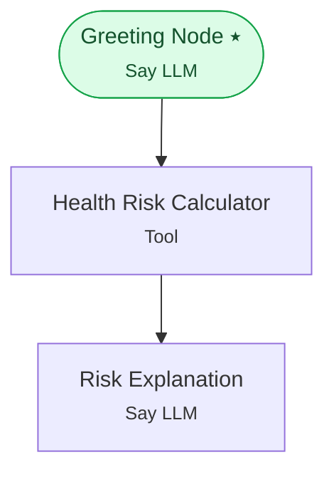

# Example 11 — Dedicated tool node

> **Progressive curriculum · step 11 of 23.** Execute exactly one tool unconditionally with a ToolNodeConfig and read its result downstream.

**Concepts introduced here:** `ToolNodeConfig`, `EndRunNodeEvent`, deterministic tool execution

| | |
|---|---|
| **Workflow name** | Example 11: Standalone Tool Execution with ToolNodeConfig |
| **Builder** | [`wf_example_progression_11.py`](./wf_example_progression_11.py) · `build_assistant_workflow()` |
| **Runnable notebook** | [`notebooks/wf_example_notebooks/wf_example_progression_11.ipynb`](../notebooks/wf_example_notebooks/wf_example_progression_11.ipynb) |
| **Nodes / edges** | 3 nodes, 2 edges |

## What it does

This workflow introduces ToolNodeConfig — a dedicated node type that unconditionally executes a single
tool as a workflow step. Unlike LLM-driven tool calls (where the model decides *whether* to call a tool),
a ToolNode always executes its configured tool when the workflow reaches that node.

Use ToolNodeConfig when you need deterministic, guaranteed execution of a side effect (fetching data,
running a calculation, calling an external service) regardless of what the user said.

The example simulates a "health-risk score" calculator: the ToolNode runs an inline Python function
to compute a risk score, stores the result in the runtime variable `[[health_risk_result]]`, and then
an LLM node reads that variable to compose a friendly explanation for the user.

## Workflow diagram



*⭑ = start node · solid arrow = direct edge · dashed arrow = conditional edge (label = condition).*

## Nodes

| Node | Type | Role |
|---|---|---|
| Greeting Node | Say LLM | start, waits for user |
| Health Risk Calculator | Tool | — |
| Risk Explanation | Say LLM | waits for user, self-loops |

## Routing

| From | To | Edge | Condition |
|---|---|---|---|
| Greeting Node | Health Risk Calculator | direct | — |
| Health Risk Calculator | Risk Explanation | direct | — |

## Run it

```bash
# Interactive, capped notebook (recommended — no input() needed):
pipenv run python notebooks/_run_e2e.py wf_example_progression_11

# Or open the notebook:
#   notebooks/wf_example_notebooks/wf_example_progression_11.ipynb

# Or the original interactive script (reads turns from stdin):
pipenv run python wf_examples/wf_example_progression_11.py
```

---
[← Example 10](./wf_example_progression_10.md) · [Curriculum index](./README.md) · [Example 12 →](./wf_example_progression_12.md)
