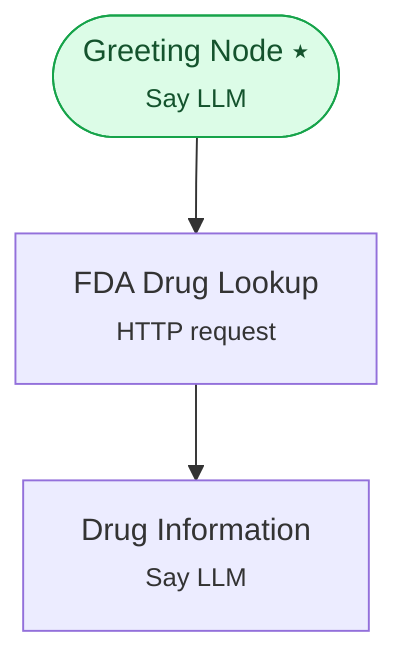

# Example 12 — Calling a REST API

> **Progressive curriculum · step 12 of 23.** Call an external HTTP endpoint from the graph and let the LLM explain the response.

**Concepts introduced here:** `HttpRequestNodeConfig`, `HttpRequestNodeEvent`, query parameters & timeouts

| | |
|---|---|
| **Workflow name** | Example 12: REST API Calls with HttpRequestNodeConfig |
| **Builder** | [`wf_example_progression_12.py`](./wf_example_progression_12.py) · `build_assistant_workflow()` |
| **Runnable notebook** | [`notebooks/wf_example_notebooks/wf_example_progression_12.ipynb`](../notebooks/wf_example_notebooks/wf_example_progression_12.ipynb) |
| **Nodes / edges** | 3 nodes, 2 edges |

## What it does

This workflow introduces HttpRequestNodeConfig — a node that sends an HTTP request to an external
REST API without requiring an LLM to decide. It is the preferred way to integrate external data
sources when the call should happen unconditionally at a known point in the workflow.

The example workflow is a simple "drug information lookup" assistant that:
1. Greets the user and asks for a drug name.
2. Calls the public Open FDA drug API (no auth required) to look up the drug.
3. An LLM reads the response (stored in [[fda_drug_result]]) and summarises the key facts.

HTTP-node features demonstrated:
- GET request with a query parameter built from a runtime variable
- JSON response format with result stored in a named runtime variable
- HttpRequestNodeEvent observation: curl_command, status_code, response_body
- Timeout configuration to avoid stalling the workflow

## Workflow diagram



*⭑ = start node · solid arrow = direct edge · dashed arrow = conditional edge (label = condition).*

## Nodes

| Node | Type | Role |
|---|---|---|
| Greeting Node | Say LLM | start, waits for user |
| FDA Drug Lookup | HTTP request | — |
| Drug Information | Say LLM | waits for user, self-loops |

## Routing

| From | To | Edge | Condition |
|---|---|---|---|
| Greeting Node | FDA Drug Lookup | direct | — |
| FDA Drug Lookup | Drug Information | direct | — |

## Run it

```bash
# Interactive, capped notebook (recommended — no input() needed):
pipenv run python notebooks/_run_e2e.py wf_example_progression_12

# Or open the notebook:
#   notebooks/wf_example_notebooks/wf_example_progression_12.ipynb

# Or the original interactive script (reads turns from stdin):
pipenv run python wf_examples/wf_example_progression_12.py
```

---
[← Example 11](./wf_example_progression_11.md) · [Curriculum index](./README.md) · [Example 13 →](./wf_example_progression_13.md)
