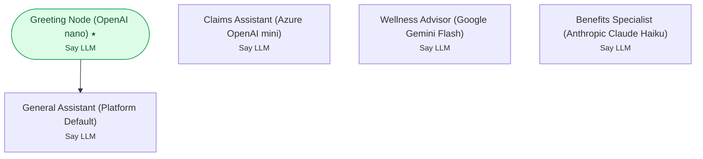

# Example 13 — Choosing LLM providers

> **Progressive curriculum · step 13 of 23.** Configure nodes to use alternative model providers (Azure / Google / Anthropic) and a platform default.

**Concepts introduced here:** provider LLM configs, `GlobalDefaultLLMConfig`, per-node model selection

| | |
|---|---|
| **Workflow name** | Example 13: Alternative LLM Providers |
| **Builder** | [`wf_example_progression_13.py`](./wf_example_progression_13.py) · `build_assistant_workflow()` |
| **Runnable notebook** | [`notebooks/wf_example_notebooks/wf_example_progression_13.ipynb`](../notebooks/wf_example_notebooks/wf_example_progression_13.ipynb) |
| **Nodes / edges** | 5 nodes, 1 edges |

## What it does

This workflow illustrates how to configure different LLM providers on a per-node basis.
Interactly supports OpenAI, Azure OpenAI, Google Gemini, Anthropic Claude, and a
GlobalDefaultLLMConfig that delegates to the platform-level default.

Each provider has its own model enum and provider-specific optional fields (e.g.
reasoning_effort for GPT-5, thinking_budget for Gemini and Claude).
All providers share a common set of base fields: max_tokens, temperature,
do_not_split_sentences, truncated_max_recent_messages, streaming, max_retries, etc.

Choosing the right provider per node lets you:
- Use a cheap nano/flash model for routing / classification nodes (low latency)
- Use a powerful model for complex reasoning nodes (high accuracy)
- Use Azure endpoints for data-residency / enterprise compliance requirements
- Use GlobalDefault so the same workflow config works across different deployments

## Workflow diagram



*⭑ = start node · solid arrow = direct edge · dashed arrow = conditional edge (label = condition).*

## Nodes

| Node | Type | Role |
|---|---|---|
| Greeting Node (OpenAI nano) | Say LLM | start |
| Claims Assistant (Azure OpenAI mini) | Say LLM | waits for user, self-loops |
| Wellness Advisor (Google Gemini Flash) | Say LLM | waits for user, self-loops |
| Benefits Specialist (Anthropic Claude Haiku) | Say LLM | waits for user, self-loops |
| General Assistant (Platform Default) | Say LLM | waits for user, self-loops |

## Routing

| From | To | Edge | Condition |
|---|---|---|---|
| Greeting Node (OpenAI nano) | General Assistant (Platform Default) | direct | — |

## Run it

```bash
# Interactive, capped notebook (recommended — no input() needed):
pipenv run python notebooks/_run_e2e.py wf_example_progression_13

# Or open the notebook:
#   notebooks/wf_example_notebooks/wf_example_progression_13.ipynb

# Or the original interactive script (reads turns from stdin):
pipenv run python wf_examples/wf_example_progression_13.py
```

---
[← Example 12](./wf_example_progression_12.md) · [Curriculum index](./README.md) · [Example 14 →](./wf_example_progression_14.md)
