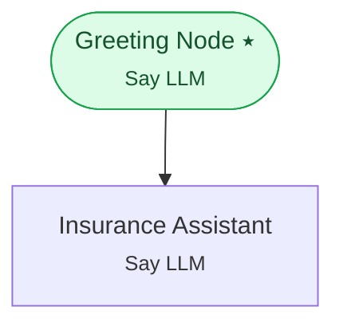

# Example 14 — Racing providers in parallel

> **Progressive curriculum · step 14 of 23.** Run several providers concurrently in an LLM group with patience windows and pick a winner.

**Concepts introduced here:** `LLMGroupConfig`, `OperationMode`, max_patience_time_ms

| | |
|---|---|
| **Workflow name** | Example 14: Multi-Provider Parallelism with LLMGroupConfig |
| **Builder** | [`wf_example_progression_14.py`](./wf_example_progression_14.py) · `build_assistant_workflow()` |
| **Runnable notebook** | [`notebooks/wf_example_notebooks/wf_example_progression_14.ipynb`](../notebooks/wf_example_notebooks/wf_example_progression_14.ipynb) |
| **Nodes / edges** | 2 nodes, 1 edges |

## What it does

This workflow demonstrates LLMGroupConfig — a way to run multiple LLM providers in
parallel or sequentially and return whichever response arrives first.

There are two operation modes:
- SEQUENTIAL_WITH_PROACTIVE: Tries the first LLM; fires fallbacks in parallel
only if the first LLM hasn't responded within min_patience_time_ms. This is the
recommended default: lowest cost in the happy path, guaranteed latency via fallback.
- PARALLEL_SELECT_ONE: Fires all LLMs simultaneously and picks the fastest response.
Higher cost but lowest possible latency.

Both modes respect max_patience_time_ms as a hard upper bound.

## Workflow diagram



*⭑ = start node · solid arrow = direct edge · dashed arrow = conditional edge (label = condition).*

## Nodes

| Node | Type | Role |
|---|---|---|
| Greeting Node | Say LLM | start |
| Insurance Assistant | Say LLM | waits for user, self-loops |

## Routing

| From | To | Edge | Condition |
|---|---|---|---|
| Greeting Node | Insurance Assistant | direct | — |

## Run it

```bash
# Interactive, capped notebook (recommended — no input() needed):
pipenv run python notebooks/_run_e2e.py wf_example_progression_14

# Or open the notebook:
#   notebooks/wf_example_notebooks/wf_example_progression_14.ipynb

# Or the original interactive script (reads turns from stdin):
pipenv run python wf_examples/wf_example_progression_14.py
```

---
[← Example 13](./wf_example_progression_13.md) · [Curriculum index](./README.md) · [Example 15 →](./wf_example_progression_15.md)
