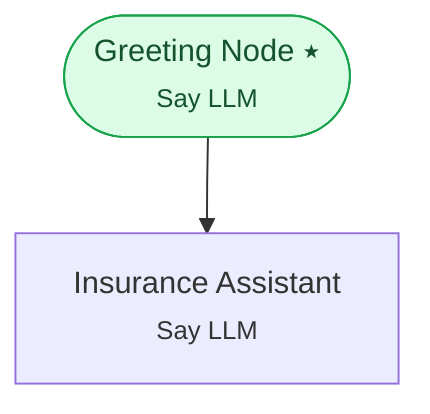

# Example 15 — External API & knowledge-base tools

> **Progressive curriculum · step 15 of 23.** Let the LLM call a hosted REST tool and search a knowledge base, injecting secrets via dynamic variables.

**Concepts introduced here:** `ExternalAPIToolConfig`, `KnowledgeBaseToolConfig`, secret injection via dynamic variables

| | |
|---|---|
| **Workflow name** | Example 15: ExternalAPIToolConfig and KnowledgeBaseToolConfig |
| **Builder** | [`wf_example_progression_15.py`](./wf_example_progression_15.py) · `build_assistant_workflow()` |
| **Runnable notebook** | [`notebooks/wf_example_notebooks/wf_example_progression_15.ipynb`](../notebooks/wf_example_notebooks/wf_example_progression_15.ipynb) |
| **Nodes / edges** | 2 nodes, 1 edges |

## What it does

This workflow introduces two LLM-invoked tool types:

ExternalAPIToolConfig — lets the LLM call an external REST API. Useful for:
- Real-time data lookups (claims status, member eligibility, appointment slots)
- CRM / EHR write-back operations
- Third-party service integrations (payments, scheduling, notifications)

KnowledgeBaseToolConfig — lets the LLM perform a semantic search over one or more
Qdrant-backed knowledge bases (RAG). Useful for:
- Grounding answers in official documentation, policy PDFs, or FAQs
- Reducing hallucinations by providing verified retrieved context
- Multi-KB queries (e.g., query both a product KB and a regulatory KB)

Both tool types are registered on the same LLM node. The LLM decides at runtime
which tool to invoke based on the user's request and the tool signatures.

## Workflow diagram



*⭑ = start node · solid arrow = direct edge · dashed arrow = conditional edge (label = condition).*

## Nodes

| Node | Type | Role |
|---|---|---|
| Greeting Node | Say LLM | start |
| Insurance Assistant | Say LLM | waits for user, self-loops |

## Routing

| From | To | Edge | Condition |
|---|---|---|---|
| Greeting Node | Insurance Assistant | direct | — |

## Dynamic variables

Seeded as `default_dynamic_variables` in the workflow's `miscellaneous`; override per run by passing `dynamic_variables=` to `arun`.

```json
{
  "cigna_api_token": "demo_token_replace_me"
}
```

## Run it

```bash
# Interactive, capped notebook (recommended — no input() needed):
pipenv run python notebooks/_run_e2e.py wf_example_progression_15

# Or open the notebook:
#   notebooks/wf_example_notebooks/wf_example_progression_15.ipynb

# Or the original interactive script (reads turns from stdin):
pipenv run python wf_examples/wf_example_progression_15.py
```

---
[← Example 14](./wf_example_progression_14.md) · [Curriculum index](./README.md) · [Example 16 →](./wf_example_progression_16.md)
