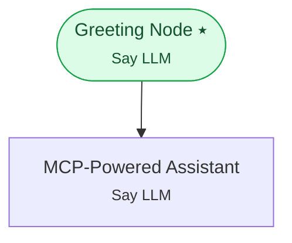

# Example 16 — MCP server integration

> **Progressive curriculum · step 16 of 23.** Register Model Context Protocol servers at the workflow level and expose their tools to a node.

**Concepts introduced here:** `MCPServerConfig`, use_mcp_tools

| | |
|---|---|
| **Workflow name** | Example 16: MCP Server Integration with MCPServerConfig |
| **Builder** | [`wf_example_progression_16.py`](./wf_example_progression_16.py) · `build_assistant_workflow()` |
| **Runnable notebook** | [`notebooks/wf_example_notebooks/wf_example_progression_16.ipynb`](../notebooks/wf_example_notebooks/wf_example_progression_16.ipynb) |
| **Nodes / edges** | 2 nodes, 1 edges |

## What it does

This workflow demonstrates MCPServerConfig — the Model Context Protocol integration.

MCP (modelcontextprotocol.io) is an open standard that decouples tool definitions from
workflow code. Instead of hardcoding ExternalAPIToolConfig objects, you register one or
more MCP server URLs at the workflow level. Interactly connects to each server,
discovers its tool catalog, and makes those tools available to any node that sets
use_mcp_tools=True.

When to use MCP vs. explicit tool configs:
- Use MCPServerConfig when you have an existing MCP-compatible tool server (e.g. a
company-internal MCP gateway that already wraps your APIs).
- Use ExternalAPIToolConfig / InlinePythonToolConfig for quick, self-contained tool
definitions that don't need a separate server process.

Setup requirements for running this example:
- You need a running MCP server at the configured server_url.
- The server must implement the MCP spec (listTools + callTool endpoints).
- Set the Authorization header with a valid token (or remove it for public servers).
- A minimal test MCP server can be started with: https://github.com/modelcontextprotocol

## Workflow diagram



*⭑ = start node · solid arrow = direct edge · dashed arrow = conditional edge (label = condition).*

## Nodes

| Node | Type | Role |
|---|---|---|
| Greeting Node | Say LLM | start |
| MCP-Powered Assistant | Say LLM | waits for user, self-loops |

## Routing

| From | To | Edge | Condition |
|---|---|---|---|
| Greeting Node | MCP-Powered Assistant | direct | — |

## Dynamic variables

Seeded as `default_dynamic_variables` in the workflow's `miscellaneous`; override per run by passing `dynamic_variables=` to `arun`.

```json
{
  "mcp_api_token": "demo_token_replace_me",
  "tenant_id": "cigna-demo"
}
```

## Run it

```bash
# Interactive, capped notebook (recommended — no input() needed):
pipenv run python notebooks/_run_e2e.py wf_example_progression_16

# Or open the notebook:
#   notebooks/wf_example_notebooks/wf_example_progression_16.ipynb

# Or the original interactive script (reads turns from stdin):
pipenv run python wf_examples/wf_example_progression_16.py
```

---
[← Example 15](./wf_example_progression_15.md) · [Curriculum index](./README.md) · [Example 17 →](./wf_example_progression_17.md)
