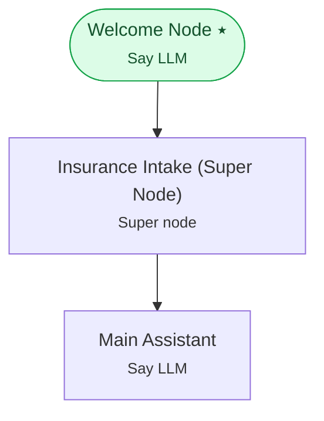

# Example 17 — Composing workflows (super nodes)

> **Progressive curriculum · step 17 of 23.** Embed a reusable sub-workflow inside a parent workflow as a single super node.

**Concepts introduced here:** `SuperNodeConfig`, encapsulated_workflow_config, workflow composition

| | |
|---|---|
| **Workflow name** | Example 17: Workflow Composition with SuperNodeConfig |
| **Builder** | [`wf_example_progression_17.py`](./wf_example_progression_17.py) · `build_assistant_workflow()` |
| **Runnable notebook** | [`notebooks/wf_example_notebooks/wf_example_progression_17.ipynb`](../notebooks/wf_example_notebooks/wf_example_progression_17.ipynb) |
| **Nodes / edges** | 3 nodes, 2 edges |

## What it does

This workflow demonstrates SuperNodeConfig — the mechanism for composing workflows
out of reusable sub-workflows.

Parent workflow structure:
[Welcome Node] → [SUPER NODE: Insurance Intake] → [Main Assistant Node]
↑
(Expands at runtime into the full intake sub-workflow:
Ask Member ID → Ask Reason)

## Workflow diagram



*⭑ = start node · solid arrow = direct edge · dashed arrow = conditional edge (label = condition).*

## Nodes

| Node | Type | Role |
|---|---|---|
| Welcome Node | Say LLM | start |
| Insurance Intake (Super Node) | Super node | — |
| Main Assistant | Say LLM | waits for user, self-loops |

## Routing

| From | To | Edge | Condition |
|---|---|---|---|
| Welcome Node | Insurance Intake (Super Node) | direct | — |
| Insurance Intake (Super Node) | Main Assistant | direct | — |

## Run it

```bash
# Interactive, capped notebook (recommended — no input() needed):
pipenv run python notebooks/_run_e2e.py wf_example_progression_17

# Or open the notebook:
#   notebooks/wf_example_notebooks/wf_example_progression_17.ipynb

# Or the original interactive script (reads turns from stdin):
pipenv run python wf_examples/wf_example_progression_17.py
```

---
[← Example 16](./wf_example_progression_16.md) · [Curriculum index](./README.md) · [Example 18 →](./wf_example_progression_18.md)
