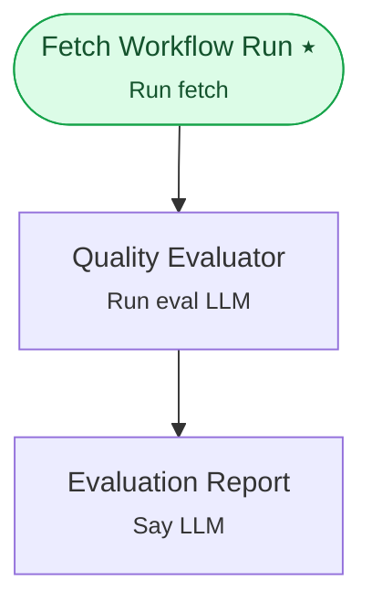

# Example 18 — Evaluation workflows

> **Progressive curriculum · step 18 of 23.** Fetch a completed run and score it with an evaluator LLM — a non-conversational, one-shot workflow.

**Concepts introduced here:** `WorkflowRunFetchNodeConfig`, `WorkflowRunEvalLLMNodeConfig`, one-shot (non-conversational) runs

| | |
|---|---|
| **Workflow name** | Example 18: Evaluation Workflow (WorkflowRunFetchNodeConfig + WorkflowRunEvalLLMNodeConfig) |
| **Builder** | [`wf_example_progression_18.py`](./wf_example_progression_18.py) · `build_assistant_workflow()` |
| **Runnable notebook** | [`notebooks/wf_example_notebooks/wf_example_progression_18.ipynb`](../notebooks/wf_example_notebooks/wf_example_progression_18.ipynb) |
| **Nodes / edges** | 3 nodes, 2 edges |

## What it does

Demonstrates how to build a post-call quality evaluation workflow.

Evaluation workflows run asynchronously AFTER a production call completes.
They use:
- WorkflowRunFetchNodeConfig to load the completed call's transcript from the DB
- WorkflowRunEvalLLMNodeConfig to score it using an LLM against defined criteria
- An optional SayLLMNodeConfig to format a human-readable evaluation report

The workflow_run_id of the target call is injected via dynamic_variables.

## Workflow diagram



*⭑ = start node · solid arrow = direct edge · dashed arrow = conditional edge (label = condition).*

## Nodes

| Node | Type | Role |
|---|---|---|
| Fetch Workflow Run | Run fetch | start |
| Quality Evaluator | Run eval LLM | — |
| Evaluation Report | Say LLM | — |

## Routing

| From | To | Edge | Condition |
|---|---|---|---|
| Fetch Workflow Run | Quality Evaluator | direct | — |
| Quality Evaluator | Evaluation Report | direct | — |

## Dynamic variables

Seeded as `default_dynamic_variables` in the workflow's `miscellaneous`; override per run by passing `dynamic_variables=` to `arun`.

```json
{
  "workflow_run_id": "6789abcdef1234567890abcd"
}
```

## Run it

```bash
# Interactive, capped notebook (recommended — no input() needed):
pipenv run python notebooks/_run_e2e.py wf_example_progression_18

# Or open the notebook:
#   notebooks/wf_example_notebooks/wf_example_progression_18.ipynb

# Or the original interactive script (reads turns from stdin):
pipenv run python wf_examples/wf_example_progression_18.py
```

---
[← Example 17](./wf_example_progression_17.md) · [Curriculum index](./README.md) · [Example 19 →](./wf_example_progression_19.md)
