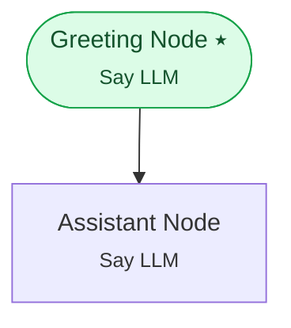

# Example 19 — Run lifecycle & commands

> **Progressive curriculum · step 19 of 23.** Drive the run lifecycle explicitly with WorkflowCommand and observe lifecycle events.

**Concepts introduced here:** WorkflowCommand (START / DATA / …), lifecycle events, per-turn run control

| | |
|---|---|
| **Workflow name** | Example 19: Advanced WorkflowCommands and Lifecycle Events |
| **Builder** | [`wf_example_progression_19.py`](./wf_example_progression_19.py) · `build_assistant_workflow()` |
| **Runnable notebook** | [`notebooks/wf_example_notebooks/wf_example_progression_19.ipynb`](../notebooks/wf_example_notebooks/wf_example_progression_19.ipynb) |
| **Nodes / edges** | 2 nodes, 1 edges |

## What it does

Demonstrates WorkflowCommand (START, DATA, RESUME, PAUSE, STOP) and the full set
of workflow lifecycle events (PauseEvent, PauseThreadEvent, EndWorkflowEvent,
EndWorkflowIterationEvent, StartRunNodeEvent, EndRunNodeEvent, WorkflowErrorEvent).

## Workflow diagram



*⭑ = start node · solid arrow = direct edge · dashed arrow = conditional edge (label = condition).*

## Nodes

| Node | Type | Role |
|---|---|---|
| Greeting Node | Say LLM | start, waits for user |
| Assistant Node | Say LLM | waits for user, self-loops |

## Routing

| From | To | Edge | Condition |
|---|---|---|---|
| Greeting Node | Assistant Node | direct | — |

## Run it

```bash
# Interactive, capped notebook (recommended — no input() needed):
pipenv run python notebooks/_run_e2e.py wf_example_progression_19

# Or open the notebook:
#   notebooks/wf_example_notebooks/wf_example_progression_19.ipynb

# Or the original interactive script (reads turns from stdin):
pipenv run python wf_examples/wf_example_progression_19.py
```

---
[← Example 18](./wf_example_progression_18.md) · [Curriculum index](./README.md) · [Example 20 →](./wf_example_progression_20.md)
