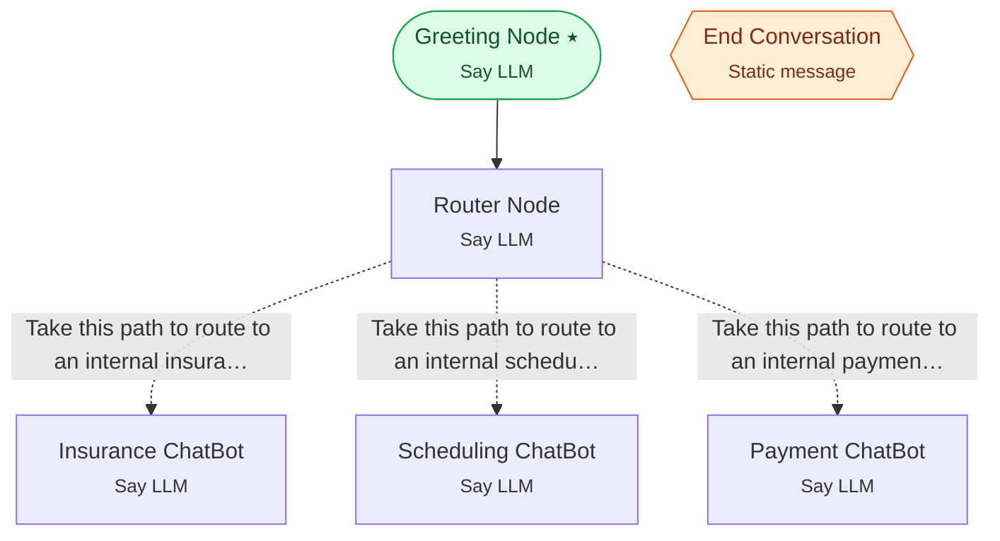

# Example 2 — Intent routing

> **Progressive curriculum · step 2 of 23.** Route the caller to one of several scoped specialist agents, then end on goodbye.

**Concepts introduced here:** Router node pattern, multiple ConditionalEdgeConfig branches, global end node (is_global)

| | |
|---|---|
| **Workflow name** | Example 2:  Topic-based Scoped Branching ChatBot |
| **Builder** | [`wf_example_progression_2.py`](./wf_example_progression_2.py) · `build_assistant_workflow()` |
| **Runnable notebook** | [`notebooks/wf_example_notebooks/wf_example_progression_2.ipynb`](../notebooks/wf_example_notebooks/wf_example_progression_2.ipynb) |
| **Nodes / edges** | 6 nodes, 4 edges |

## What it does

This workflow demonstrates a more sophisticated multi-agent system with intelligent routing capabilities.
A router agent analyzes user intent and directs the conversation to specialized agents (Insurance, Scheduling, or Payment).
It showcases how to create a branching conversation flow where a single entry point can lead to multiple specialized paths based on user needs.
A global end conversation agent can be triggered from anywhere, demonstrating universal exit handling.

## Workflow diagram



*⭑ = start node · solid arrow = direct edge · dashed arrow = conditional edge (label = condition) · hexagon = **global node** (reachable from any node in the workflow).*

## Nodes

| Node | Type | Role |
|---|---|---|
| Greeting Node | Say LLM | start |
| Router Node | Say LLM | waits for user, self-loops |
| Insurance ChatBot | Say LLM | waits for user, self-loops |
| Scheduling ChatBot | Say LLM | waits for user, self-loops |
| Payment ChatBot | Say LLM | waits for user, self-loops |
| End Conversation | Static message | global |

## Routing

| From | To | Edge | Condition |
|---|---|---|---|
| Greeting Node | Router Node | direct | — |
| Router Node | Insurance ChatBot | conditional | `Take this path to route to an internal insurance agent. Take this path only when it is cl…` |
| Router Node | Scheduling ChatBot | conditional | `Take this path to route to an internal scheduling agent. Take this path only when it is c…` |
| Router Node | Payment ChatBot | conditional | `Take this path to route to an internal payment agent. Take this path only when it is clea…` |

## Run it

```bash
# Interactive, capped notebook (recommended — no input() needed):
pipenv run python notebooks/_run_e2e.py wf_example_progression_2

# Or open the notebook:
#   notebooks/wf_example_notebooks/wf_example_progression_2.ipynb

# Or the original interactive script (reads turns from stdin):
pipenv run python wf_examples/wf_example_progression_2.py
```

---
[← Example 1](./wf_example_progression_1.md) · [Curriculum index](./README.md) · [Example 3 →](./wf_example_progression_3.md)
