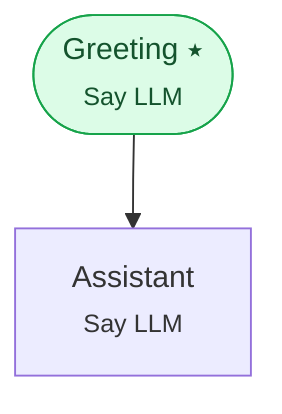

# Example 20 — The full event catalog

> **Progressive curriculum · step 20 of 23.** A reference that handles every event type the runtime can emit.

**Concepts introduced here:** complete event taxonomy, exhaustive event handling

| | |
|---|---|
| **Workflow name** | Example 20: Full Event Handling Reference |
| **Builder** | [`wf_example_progression_20.py`](./wf_example_progression_20.py) · `build_assistant_workflow()` |
| **Runnable notebook** | [`notebooks/wf_example_notebooks/wf_example_progression_20.ipynb`](../notebooks/wf_example_notebooks/wf_example_progression_20.ipynb) |
| **Nodes / edges** | 2 nodes, 1 edges |

## What it does

A minimal workflow designed to demonstrate every possible event type.
Use this file as your copy-paste template for production service loops.

## Workflow diagram



*⭑ = start node · solid arrow = direct edge · dashed arrow = conditional edge (label = condition).*

## Nodes

| Node | Type | Role |
|---|---|---|
| Greeting | Say LLM | start, waits for user |
| Assistant | Say LLM | waits for user, self-loops |

## Routing

| From | To | Edge | Condition |
|---|---|---|---|
| Greeting | Assistant | direct | — |

## Run it

```bash
# Interactive, capped notebook (recommended — no input() needed):
pipenv run python notebooks/_run_e2e.py wf_example_progression_20

# Or open the notebook:
#   notebooks/wf_example_notebooks/wf_example_progression_20.ipynb

# Or the original interactive script (reads turns from stdin):
pipenv run python wf_examples/wf_example_progression_20.py
```

---
[← Example 19](./wf_example_progression_19.md) · [Curriculum index](./README.md) · [Example 21 →](./wf_example_progression_21.md)
