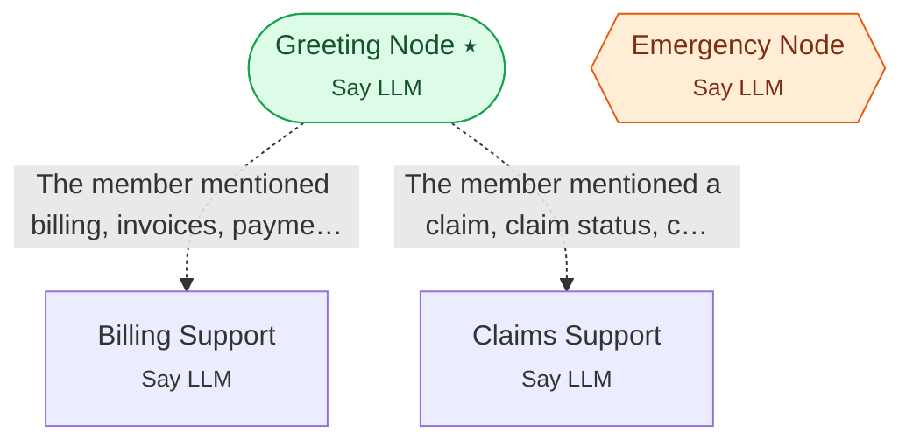

# Example 21 — Advanced conditions & global escalation

> **Progressive curriculum · step 21 of 23.** Use structured condition arguments and a global escalation node with a reverse edge.

**Concepts introduced here:** ConditionConfig args_schema, global_condition_evaluation_method, reverse_conditional_edge

| | |
|---|---|
| **Workflow name** | Example 21: Advanced Condition Features |
| **Builder** | [`wf_example_progression_21.py`](./wf_example_progression_21.py) · `build_assistant_workflow()` |
| **Runnable notebook** | [`notebooks/wf_example_notebooks/wf_example_progression_21.ipynb`](../notebooks/wf_example_notebooks/wf_example_progression_21.ipynb) |
| **Nodes / edges** | 4 nodes, 2 edges |

## What it does

Demonstrates the full condition system:
- condition_freeform vs condition_expression on ConditionConfig
- args_schema for structured LLM argument extraction
- static_messages_config and dynamic_messages_config when edges fire
- GlobalNodeConfig: is_global, condition, reverse_conditional_edge
- global_condition_evaluation_method at workflow and node levels

## Workflow diagram



*⭑ = start node · solid arrow = direct edge · dashed arrow = conditional edge (label = condition) · hexagon = **global node** (reachable from any node in the workflow).*

## Nodes

| Node | Type | Role |
|---|---|---|
| Greeting Node | Say LLM | start, waits for user |
| Billing Support | Say LLM | waits for user, self-loops |
| Claims Support | Say LLM | waits for user, self-loops |
| Emergency Node | Say LLM | global, waits for user |

## Routing

| From | To | Edge | Condition |
|---|---|---|---|
| Greeting Node | Billing Support | conditional | `The member mentioned billing, invoices, payment, premium, or deductible inquiry.` |
| Greeting Node | Claims Support | conditional | `The member mentioned a claim, claim status, claim submission, or reimbursement.` |

## Run it

```bash
# Interactive, capped notebook (recommended — no input() needed):
pipenv run python notebooks/_run_e2e.py wf_example_progression_21

# Or open the notebook:
#   notebooks/wf_example_notebooks/wf_example_progression_21.ipynb

# Or the original interactive script (reads turns from stdin):
pipenv run python wf_examples/wf_example_progression_21.py
```

---
[← Example 20](./wf_example_progression_20.md) · [Curriculum index](./README.md) · [Example 22 →](./wf_example_progression_22.md)
