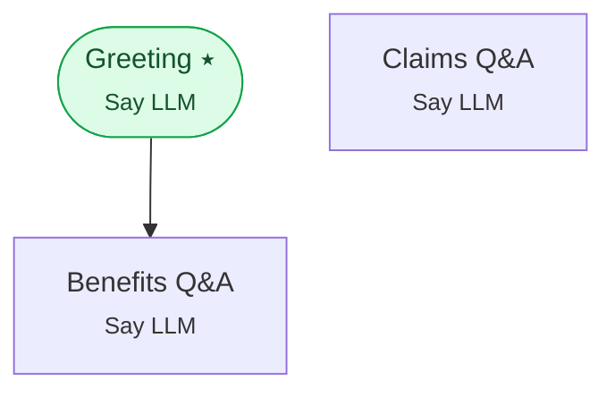

# Example 22 — Backchannels

> **Progressive curriculum · step 22 of 23.** Emit natural filler while the main model is still thinking, using a backchannel group.

**Concepts introduced here:** `LLMGroupWithBackchannelConfig`, `SEQUENTIAL_WITH_PROACTIVE`

| | |
|---|---|
| **Workflow name** | Example 22: LLMGroupWithBackchannelConfig |
| **Builder** | [`wf_example_progression_22.py`](./wf_example_progression_22.py) · `build_assistant_workflow()` |
| **Runnable notebook** | [`notebooks/wf_example_notebooks/wf_example_progression_22.ipynb`](../notebooks/wf_example_notebooks/wf_example_progression_22.ipynb) |
| **Nodes / edges** | 3 nodes, 1 edges |

## What it does

Demonstrates LLMGroupWithBackchannelConfig for low-latency voice conversations.
When the main LLM is slow, a backchannel filler fires immediately to avoid silence.

## Workflow diagram



*⭑ = start node · solid arrow = direct edge · dashed arrow = conditional edge (label = condition).*

## Nodes

| Node | Type | Role |
|---|---|---|
| Greeting | Say LLM | start, waits for user |
| Benefits Q&A | Say LLM | waits for user, self-loops |
| Claims Q&A | Say LLM | waits for user, self-loops |

## Routing

| From | To | Edge | Condition |
|---|---|---|---|
| Greeting | Benefits Q&A | direct | — |

## Run it

```bash
# Interactive, capped notebook (recommended — no input() needed):
pipenv run python notebooks/_run_e2e.py wf_example_progression_22

# Or open the notebook:
#   notebooks/wf_example_notebooks/wf_example_progression_22.ipynb

# Or the original interactive script (reads turns from stdin):
pipenv run python wf_examples/wf_example_progression_22.py
```

---
[← Example 21](./wf_example_progression_21.md) · [Curriculum index](./README.md) · [Example 23 →](./wf_example_progression_23.md)
