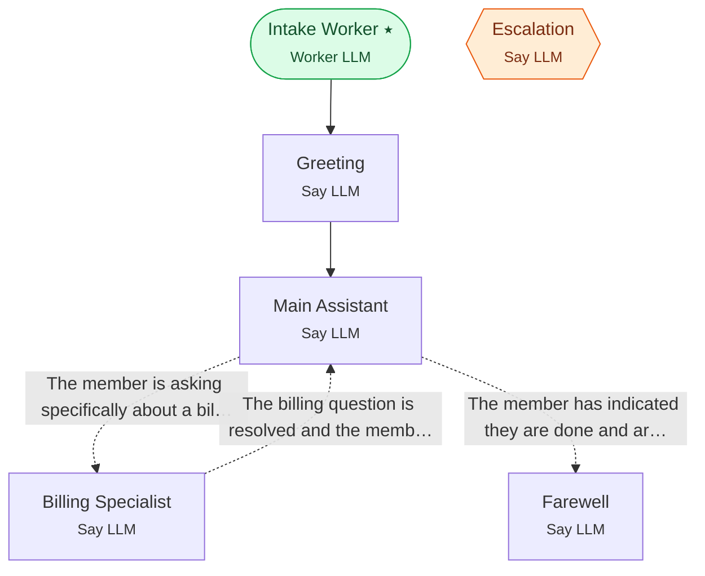

# Example 23 — Capstone: full member-services agent

> **Progressive curriculum · step 23 of 23.** Synthesise the whole curriculum into one production-shaped agent.

**Concepts introduced here:** WorkerLLM + backchannel group, external API + KB tools, global escalation + reverse edge, conditional routing to a farewell terminal

| | |
|---|---|
| **Workflow name** | Example 23: Synthesis Capstone — Cigna Member Services |
| **Builder** | [`wf_example_progression_23.py`](./wf_example_progression_23.py) · `build_assistant_workflow()` |
| **Runnable notebook** | [`notebooks/wf_example_notebooks/wf_example_progression_23.ipynb`](../notebooks/wf_example_notebooks/wf_example_progression_23.ipynb) |
| **Nodes / edges** | 6 nodes, 5 edges |

## What it does

Full-featured inbound member services AI agent combining:
WorkerLLMNodeConfig, SayLLMNodeConfig, LLMGroupWithBackchannelConfig,
ExternalAPIToolConfig, KnowledgeBaseToolConfig, ConditionalEdgeConfig with
ConditionConfig (args_schema, dynamic/static messages), GlobalNodeConfig with
reverse_conditional_edge, WorkflowCommand lifecycle, and comprehensive events.

## Workflow diagram



*⭑ = start node · solid arrow = direct edge · dashed arrow = conditional edge (label = condition) · hexagon = **global node** (reachable from any node in the workflow).*

## Nodes

| Node | Type | Role |
|---|---|---|
| Intake Worker | Worker LLM | start |
| Greeting | Say LLM | waits for user |
| Main Assistant | Say LLM | waits for user, self-loops |
| Billing Specialist | Say LLM | waits for user, self-loops |
| Farewell | Say LLM | — |
| Escalation | Say LLM | global, waits for user |

## Routing

| From | To | Edge | Condition |
|---|---|---|---|
| Intake Worker | Greeting | direct | — |
| Greeting | Main Assistant | direct | — |
| Main Assistant | Billing Specialist | conditional | `The member is asking specifically about a bill, invoice, payment, premium charge, or EOB …` |
| Main Assistant | Farewell | conditional | `The member has indicated they are done and are ending the call — e.g. 'goodbye', 'that's …` |
| Billing Specialist | Main Assistant | conditional | `The billing question is resolved and the member wants to ask something else.` |

## Dynamic variables

Seeded as `default_dynamic_variables` in the workflow's `miscellaneous`; override per run by passing `dynamic_variables=` to `arun`.

```json
{
  "member_id": "MBR-987654",
  "api_token": "mock-token-abc123"
}
```

## Run it

```bash
# Interactive, capped notebook (recommended — no input() needed):
pipenv run python notebooks/_run_e2e.py wf_example_progression_23

# Or open the notebook:
#   notebooks/wf_example_notebooks/wf_example_progression_23.ipynb

# Or the original interactive script (reads turns from stdin):
pipenv run python wf_examples/wf_example_progression_23.py
```

---
[← Example 22](./wf_example_progression_22.md) · [Curriculum index](./README.md) · 🎓 end of curriculum
