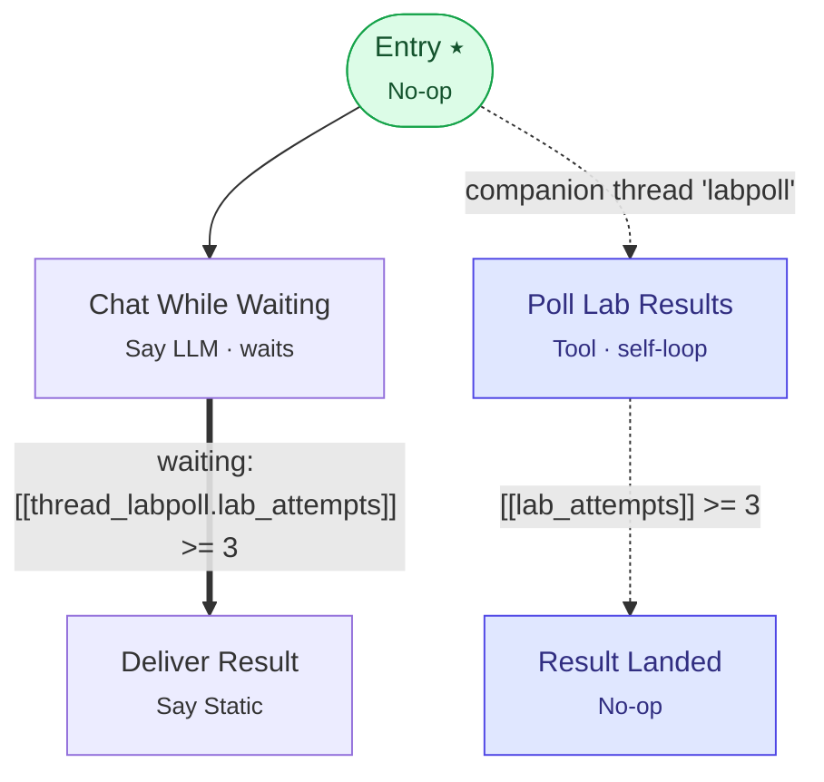

# Example 24 — Background work: companion threads + evaluate-while-waiting

> **Progressive curriculum · step 24 of 25 — beyond the capstone.** Two features that only make sense together: one produces a fact in the background, the other lets that fact interrupt a conversation.

**Concepts introduced here:** CompanionThreadConfig, SelfLoopConfig, cross-thread variables, EvaluateWhileWaitingConfig, NoOpNodeConfig as a fork point

| | |
|---|---|
| **Workflow name** | Example 24: Companion thread + evaluate-while-waiting |
| **Builder** | [`wf_example_progression_24.py`](./wf_example_progression_24.py) · `build_assistant_workflow()` |
| **Runnable notebook** | [`notebooks/wf_example_notebooks/wf_example_progression_24.ipynb`](../notebooks/wf_example_notebooks/wf_example_progression_24.ipynb) · concepts in [`notebooks/19_companion_threads.ipynb`](../notebooks/19_companion_threads.ipynb) |
| **Nodes / edges** | 5 nodes, 4 edges |

## What it does

A caller has had blood work done and rings in to ask whether the results are back. Instead of
making them hold in silence:

1. a **companion thread** polls the lab system in the background, bounded so it cannot run forever;
2. the **main thread** carries on the conversation and parks waiting for the caller;
3. when the poll succeeds, an **evaluate-while-waiting** edge fires and the workflow speaks the
   result — **with no user message**.

Step 3 is the part that is hard to build any other way. A conditional edge is normally evaluated at
exactly one moment: right after its source node executes. A parked `say_llm` node never executes
again until the caller speaks, so a variable that changes in the background cannot move the
conversation on its own. That is the gap this closes.

## Workflow diagram



*⭑ = start node · solid arrow = direct edge · dashed arrow into the blue nodes = the **companion fork** · thick arrow = the **evaluate-while-waiting** edge (fires with no user message).*

## Nodes

| Node | Type | Role |
|---|---|---|
| Entry | No-op | start; exists only to fan out |
| Poll Lab Results | Tool (inline Python) | companion thread `labpoll`; self-loops on a bound |
| Result Landed | No-op | companion's terminal node |
| Chat While Waiting | Say LLM | main thread; waits for user |
| Deliver Result | Say Static | reached with no user message |

## Routing

| From | To | Edge | Condition |
|---|---|---|---|
| Entry | Chat While Waiting | direct (**main**) | — |
| Entry | Poll Lab Results | direct (**companion** `labpoll`) | — |
| Poll Lab Results | Result Landed | conditional | `[[lab_attempts]] >= 3` |
| Chat While Waiting | Deliver Result | conditional + **evaluate-while-waiting** | `[[thread_labpoll.lab_attempts]] >= 3` |

## Key details

### Why the fork is on `Entry` and not on the chat node

A node with outgoing **direct** edges cannot also carry an evaluate-while-waiting conditional edge.
Direct edges take precedence on the normal transition path, so such an edge would fire *only* in the
background and never after a node execution — divergent behaviour from one config. The server
rejects it with a 400.

So: **fork upstream of the node that waits.** That is the entire reason `Entry` exists, and why a
no-op node is the natural choice for it — it does no work, it is just somewhere to fan out from.

Put the fork on `Chat While Waiting` instead and creation fails with:

```
BadRequestError: Invalid 'evaluate while waiting for user input' edge configuration:
Edge 'e1' has evaluate_while_waiting_config enabled but its source node also has outgoing
direct edges, which take precedence on the normal transition path.
```

### Naming the thread is what makes it readable

`thread_id="labpoll"` is optional. Without it the thread still runs, but the server mints a uuid at
fork time and **no other thread can reference its variables** — which would make the waiting
condition here impossible to write. The main thread is always `thread_0`.

```
[[thread_labpoll.lab_attempts]]   # any thread reading the companion's variable
[[thread_0.customer_name]]        # the companion reading the main thread
```

### Keep tool results flat if you want to read them back

The poll tool returns a **plain integer**, not a dict. That is deliberate: dotted access into a
dict-valued runtime variable is **not** interpolated. A prompt containing `[[lab_poll.value]]` where
`lab_poll` holds `{"value": ...}` comes through to the caller as the literal text
`[[lab_poll.value]]` — no error, just the placeholder read aloud.

If a downstream node or condition needs a field, have the tool return that field directly.

### The condition language is smaller than it looks

`==`, `!=`, `<`, `<=`, `>`, `>=`, `AND`/`OR`/`NOT`, and the unary forms `isPresent(…)`,
`isAbsent(…)`, `isEmpty(…)`, `isNonEmpty(…)`. There is no `contains()`, and an unsupported call
fails the **run**, not the save:

```
workflow_error: Error evaluating condition expression 'contains('pending:1', 'approved')' …
```

### `self_loop` and `SelfLoopConfig` are unrelated

The chat node has `self_loop=True` and the poll node has `self_loop_config=…`. These are different
features that happen to share a word:

| | `SelfLoopConfig` (poll node) | `self_loop: bool` (chat node) |
|---|---|---|
| Applies to | any node | LLM nodes only |
| Governs | re-executing the node's own work | looping back while waiting for the caller |
| Bounded by | `max_retries` / `expiry_time` | the conversation |

### Not the same "companion" as example 6

[Example 6](./wf_example_progression_6.md) uses `CompanionEdgeConfig` — an **edge type** that pairs a
Say agent with a silent Worker agent within one turn. This example uses `CompanionThreadConfig` — a
**setting on a direct edge** that forks a genuinely concurrent background thread. Same word, unrelated
mechanisms.

## Driving it: WebSocket vs REST

Examples 1–23 drive their runs through an `AsyncWorkflowHandle`, which goes over HTTP. This one uses
`client.runs.stream()`, and the reason is not stylistic:

| | Background work |
|---|---|
| `client.runs.stream()` (WebSocket) | The driver pumps it for you. Nothing to do. |
| `client.runs.execute()` (REST) | **Does not advance on its own.** You must pump. |

`run_over_rest()` at the bottom of the script shows the REST path — `drive_background_work()`, which
polls `pump_companions()` until nothing is left, bounded by `max_iterations` so a long-running
companion cannot block forever.

> **Requires a server build that includes `interactly-ai@6b09ada25`** (live on dev since 2026-08-08).
> Earlier builds broke out of the runtime generator on the busy-wait event, cancelling the drain loop
> while the companion was still mid-execution — so `has_background_work` came back `False` and there
> was nothing to pump. `stream()` was never affected.

### `end_workflow_iteration` is no longer "your turn"

Once companions are in play, three events diverge that used to coincide:

| Event | Means |
|---|---|
| `end_workflow_iteration` | One turn's accounting is done. Companions may still be running. |
| `workflow_ready_for_input` | Every non-companion thread has settled. **Send the next message.** |
| `end_workflow` | Every thread has ended, companions included. |

Break on `event.is_ready_for_input()`, not on `end_workflow_iteration` — the older idiom races or
cuts off mid-turn here.

### Two things the events will surprise you with

- **`active_companion_thread_ids` holds internal ids.** On `workflow_ready_for_input` you get
  `['0_companion_labpoll']`, not `['labpoll']`. Match on the suffix, not equality.
- **Event-specific fields are top-level attributes, not `event.data`.** `RunEvent` is
  `extra="allow"`, so `self_loop_exhausted` carries `event.outcome` and `event.total_attempts`
  directly. `event.data` is never populated by the server.

## Sample run

```
Created workflow 6a7670acc4436e6511a9631d
   … still running in the background: ['0_companion_labpoll']
👤 Caller: Sure, I'll hold.
   ⏳ [labpoll] one poll step finished
   ⏳ [labpoll] one poll step finished

   ⚡ waiting condition matched — advancing with NO user message

🤖 Assistant: Good news — your lab results just came through: A1C 5.4%, within range.

✅ Run finished (end_workflow).
```

## Run it

```bash
# Directly:
pipenv run python wf_examples/wf_example_progression_24.py

# Or the notebook counterpart:
#   notebooks/wf_example_notebooks/wf_example_progression_24.ipynb

# Or the concept notebook, which also covers the REST path:
#   notebooks/19_companion_threads.ipynb
```

## See also

- [Companion threads](../docs/guides/companion_threads.md) — the four graph rules in full
- [Evaluate while waiting](../docs/guides/waiting_evaluation.md) — trigger modes and all nine validation rules
- [Self-loops](../docs/guides/self_loops.md) — bounding the poller

---
[← Example 23](./wf_example_progression_23.md) · [Curriculum index](./README.md) · [Example 25 →](./wf_example_progression_25.md)
