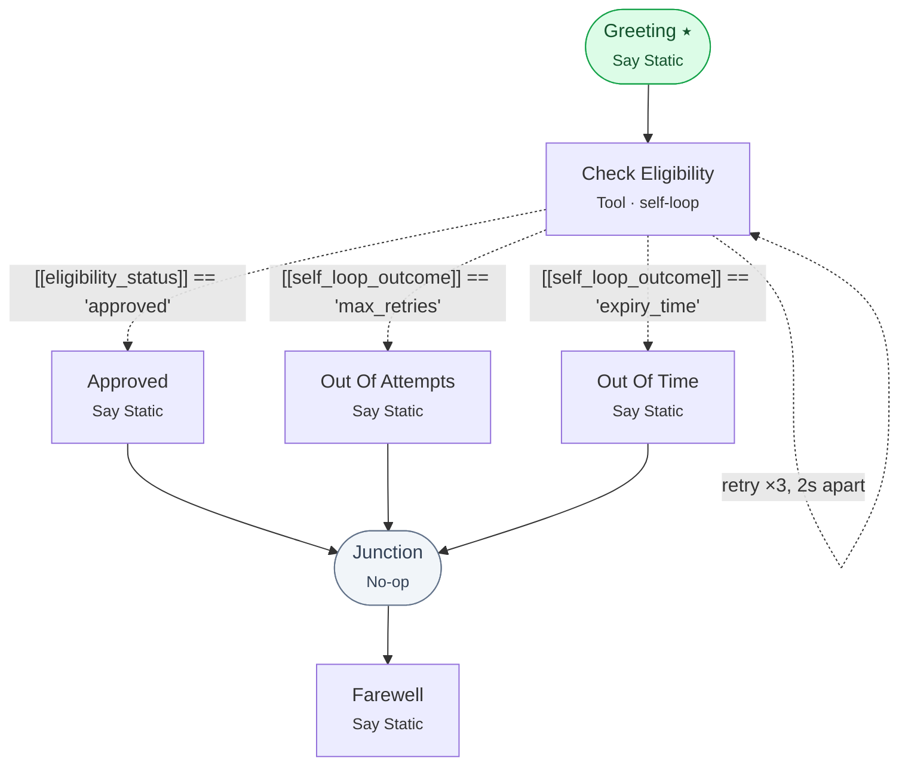

# Example 25 — Bounded retries and self-loop outcomes

> **Progressive curriculum · step 25 of 25 — beyond the capstone.** Retry a flaky step on a bound the runtime enforces, then branch on *how* the loop ended.

**Concepts introduced here:** SelfLoopConfig on a node, `[[self_loop_outcome]]` branching, NoOpNodeConfig as a fan-in junction, feeding a node's own previous result back in

| | |
|---|---|
| **Workflow name** | Example 25: Bounded retries and self-loop outcomes |
| **Builder** | [`wf_example_progression_25.py`](./wf_example_progression_25.py) · `build_assistant_workflow()` |
| **Runnable notebook** | [`notebooks/wf_example_notebooks/wf_example_progression_25.ipynb`](../notebooks/wf_example_notebooks/wf_example_progression_25.ipynb) · concepts in [`notebooks/20_waiting_conditions.ipynb`](../notebooks/20_waiting_conditions.ipynb) |
| **Nodes / edges** | 7 nodes, 8 edges |

## What it does

A caller asks whether they are covered for a procedure. The eligibility service is slow and
sometimes does not answer at all, so the check node **retries on a bound** rather than blocking or
failing outright.

The script runs the same workflow **twice**, changing only a dynamic variable:

| Run | `mode` | What happens |
|---|---|---|
| 1 | `"normal"` | The check answers on its second attempt — the happy exit |
| 2 | `"always_pending"` | It never answers; the loop exhausts and `self_loop_outcome` routes to the apology branch |

Run 2 is the one worth studying. **A retry loop that gives up and has nowhere to go simply stops** —
and from the outside a stalled workflow and a finished one look identical.

## Workflow diagram



*⭑ = start node · solid arrow = direct edge · dashed arrow = conditional edge · the self-arrow is the bounded loop.*

## Nodes

| Node | Type | Role |
|---|---|---|
| Greeting | Say Static | start |
| Check Eligibility | Tool (inline Python) | self-loops on a bound |
| Approved | Say Static | happy exit |
| Out Of Attempts | Say Static | `max_retries` exit |
| Out Of Time | Say Static | `expiry_time` exit |
| Junction | No-op | fan-in for all three |
| Farewell | Say Static | one farewell, reachable from every branch |

## Routing

| From | To | Edge | Condition |
|---|---|---|---|
| Greeting | Check Eligibility | direct | — |
| Check Eligibility | Approved | conditional | `[[eligibility_status]] == 'approved'` |
| Check Eligibility | Out Of Attempts | conditional | `[[self_loop_outcome]] == 'max_retries'` |
| Check Eligibility | Out Of Time | conditional | `[[self_loop_outcome]] == 'expiry_time'` |
| Approved / Out Of Attempts / Out Of Time | Junction | direct | — |
| Junction | Farewell | direct | — |

## Key details

### The loop stops on whichever comes first

```python
self_loop_config=SelfLoopConfig(
    enabled=True,
    max_retries=3,        # 3 retries => up to 4 executions in total
    expiry_time=45,       # ...and never longer than 45s
    time_between_retries=2,
)
```

Three ways out, in priority order:

1. **an outgoing conditional edge matches** — the normal exit. Outgoing conditionals are
   re-evaluated after *every* execution, which is what decides "leave" vs. "go round again";
2. `max_retries` re-executions have happened;
3. the `expiry_time` wall-clock budget for the whole loop elapses.

`max_retries` counts **retries, not attempts** — `max_retries=3` runs the node up to four times.

### At least one bound is required, and the SDK enforces it

```python
SelfLoopConfig(enabled=True)                    # ValidationError, at construction
SelfLoopConfig(enabled=True, max_retries=3)     # fine
SelfLoopConfig(enabled=True, expiry_time=30)    # fine
```

This is validated **client-side**, before any request is sent. A loop that could never terminate is
worth catching at authoring time rather than in production.

### `self_loop_outcome` is only published when the loop gives up

If an exit edge matched, the loop ended normally and there is no outcome to report. The variable
appears **only** when the loop stopped on a bound, and holds `'max_retries'` or `'expiry_time'`.

Without edges 2 and 3 above, run 2 would leave the caller at a node that quietly stopped executing.
**Always give an exhausted loop somewhere to go.**

### `expiry_time` cannot interrupt CPU-bound work

An execution still running when the budget elapses is terminated — but only if it *can* be. A
CPU-bound inline-Python body with no `await` points cannot be interrupted mid-execution, so expiry
reliably bounds I/O-bound work (HTTP calls, EHR lookups) and does not reliably bound a tight compute
loop. If a node might spin on CPU, bound it with `max_retries` as well.

### The node reads its own previous result

```python
tool_arguments={
    "previous_status": "[[eligibility_status]]",   # ...its own output variable
    "mode": "{{mode}}",
},
result_runtime_variable_name="eligibility_status",
```

That is how a self-looping node carries state between attempts: the tool stays stateless, and the
runtime variable is the memory. On the first execution the variable is unset, which is exactly the
"nothing yet" case the tool already handles.

Note the two syntaxes: `[[…]]` is a **runtime** variable (written during the run), `{{…}}` is a
**dynamic** variable (supplied when the run starts). Both interpolate in `tool_arguments`.

### The no-op junction

Three branches converge on `Junction`, which does nothing. Without it, the farewell would have to be
duplicated on all three branches.

**This is not `disabled=True`.** A disabled node is skipped entirely and emits no events, so a
downstream conditional edge would have nothing to branch on. A no-op node *runs*: it emits the usual
node start/end events and writes `junction` / `junction_success` to thread state.

### Watching the loop

| Event | Carries |
|---|---|
| `self_loop_delay` | `attempt_number`, `delay_seconds`, `reason` |
| `self_loop_exhausted` | `outcome`, `total_attempts`, `reason` |
| `node_expired` | an in-flight execution was terminated by `expiry_time` |

These arrive as **top-level attributes** on the event (`RunEvent` is `extra="allow"`), not under
`event.data` — which the server never populates.

## Sample run

```
======================================================================
  Run 1 — the check answers  (mode='normal')
======================================================================
🤖 Let me check your coverage — one moment please.
   ⏱️  attempt 2, waiting 2.0s
🤖 Good news — you're covered for this procedure.
🤖 Thanks for calling — goodbye.
→ end_workflow

======================================================================
  Run 2 — the check never answers  (mode='always_pending')
======================================================================
🤖 Let me check your coverage — one moment please.
   ⏱️  attempt 2, waiting 2.0s
   ⏱️  attempt 3, waiting 2.0s
   ⏱️  attempt 4, waiting 2.0s
   ⛔ stopped on 'max_retries' after 4 attempts
🤖 I couldn't get an answer from our eligibility system just now — I'll email you today.
🤖 Thanks for calling — goodbye.
→ end_workflow
```

## Dynamic variables

Seeded as `default_dynamic_variables` on the workflow config; overridden per run by passing
`dynamic_variables=` to `stream()`.

```json
{
  "mode": "normal"
}
```

## Run it

```bash
pipenv run python wf_examples/wf_example_progression_25.py

# Or the notebook counterpart:
#   notebooks/wf_example_notebooks/wf_example_progression_25.ipynb
```

## See also

- [Self-loops & retries](../docs/guides/self_loops.md) — the full feature
- [Example 24](./wf_example_progression_24.md) — the same loop, running in a companion thread
- [Nodes, edges & tools](../docs/guides/nodes_edges_tools.md) — the no-op node

---
[← Example 24](./wf_example_progression_24.md) · [Curriculum index](./README.md) · 🎓 end of curriculum
