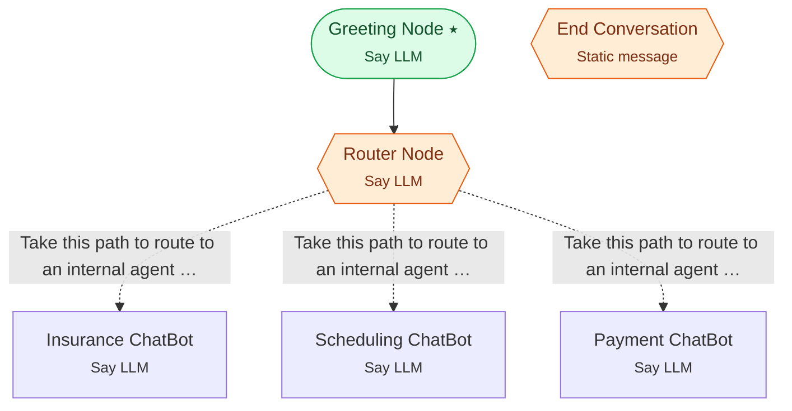

# Example 3 — Global router + dynamic variables

> **Progressive curriculum · step 3 of 23.** Make the router global (re-routable mid-conversation) and parameterise prompts with dynamic variables.

**Concepts introduced here:** `GlobalNodeConfig`, default_dynamic_variables, default_prompt_prefix / default_prompt_suffix, {{variable}} templating

| | |
|---|---|
| **Workflow name** | Example 3:  Branching ChatBot with more flavors |
| **Builder** | [`wf_example_progression_3.py`](./wf_example_progression_3.py) · `build_assistant_workflow()` |
| **Runnable notebook** | [`notebooks/wf_example_notebooks/wf_example_progression_3.ipynb`](../notebooks/wf_example_notebooks/wf_example_progression_3.ipynb) |
| **Nodes / edges** | 6 nodes, 4 edges |

## What it does

This workflow builds upon Example 2 by introducing dynamic variables for runtime customization and global re-routing capabilities.
Users can inject custom values (like greeting phrases, supported intents, farewell messages) at workflow execution time.
Additionally, the router agent becomes globally accessible, allowing users to switch between agents mid-conversation - for example, starting with insurance questions, then switching to scheduling without ending the conversation.

## Workflow diagram



*⭑ = start node · solid arrow = direct edge · dashed arrow = conditional edge (label = condition) · hexagon = **global node** (reachable from any node in the workflow).*

## Nodes

| Node | Type | Role |
|---|---|---|
| Greeting Node | Say LLM | start |
| Router Node | Say LLM | global, waits for user, self-loops |
| Insurance ChatBot | Say LLM | waits for user, self-loops |
| Scheduling ChatBot | Say LLM | waits for user, self-loops |
| Payment ChatBot | Say LLM | waits for user, self-loops |
| End Conversation | Static message | global |

## Routing

| From | To | Edge | Condition |
|---|---|---|---|
| Greeting Node | Router Node | direct | — |
| Router Node | Insurance ChatBot | conditional | `Take this path to route to an internal agent that will help with insurance questions. Tak…` |
| Router Node | Scheduling ChatBot | conditional | `Take this path to route to an internal agent that will help with scheduling questions. Ta…` |
| Router Node | Payment ChatBot | conditional | `Take this path to route to an internal agent that will help with payment questions. Take …` |

## Dynamic variables

Seeded as `default_dynamic_variables` in the workflow's `miscellaneous`; override per run by passing `dynamic_variables=` to `arun`.

```json
{
  "greeting_phrase": "Hello, Welcome to Cigna Healthcare",
  "supported_intents": [
    "appointments",
    "insurance",
    "payment"
  ],
  "farewell_phrase_1": "Thank you for chatting with CignaCare Assistant. Have a great day!",
  "farewell_phrase_2": "We appreciate your time. Goodbye!"
}
```

## Run it

```bash
# Interactive, capped notebook (recommended — no input() needed):
pipenv run python notebooks/_run_e2e.py wf_example_progression_3

# Or open the notebook:
#   notebooks/wf_example_notebooks/wf_example_progression_3.ipynb

# Or the original interactive script (reads turns from stdin):
pipenv run python wf_examples/wf_example_progression_3.py
```

---
[← Example 2](./wf_example_progression_2.md) · [Curriculum index](./README.md) · [Example 4 →](./wf_example_progression_4.md)
