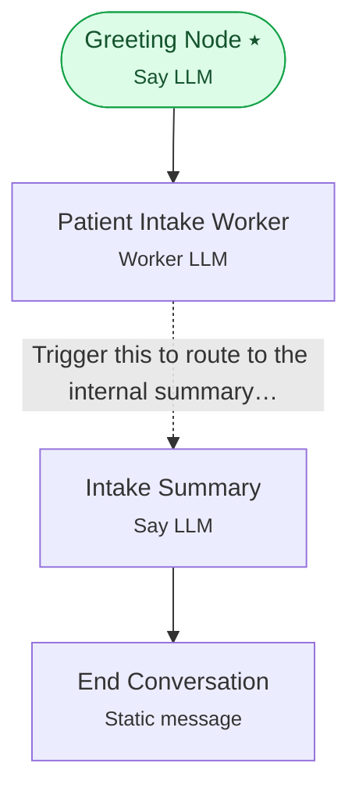

# Example 4 — Structured data capture

> **Progressive curriculum · step 4 of 23.** Silently extract a typed intake form with a Worker LLM and route once required fields are present.

**Concepts introduced here:** `WorkerLLMNodeConfig`, structured output schema, freeform condition over extracted fields

| | |
|---|---|
| **Workflow name** | Example 4: Structured Output with Worker LLM |
| **Builder** | [`wf_example_progression_4.py`](./wf_example_progression_4.py) · `build_assistant_workflow()` |
| **Runnable notebook** | [`notebooks/wf_example_notebooks/wf_example_progression_4.ipynb`](../notebooks/wf_example_notebooks/wf_example_progression_4.ipynb) |
| **Nodes / edges** | 4 nodes, 3 edges |

## What it does

This workflow introduces Worker LLM agents - AI agents that perform tasks in the background without directly communicating with the user.
Unlike conversational "Say LLM" agents, the output of Worker LLM agents is not sent directly to the user.
In this example, we demonstrate how Worker LLM agents can be used to extract structured information from user interactions.
This workflow demonstrates a healthcare patient intake process that collects structured information.

## Workflow diagram



*⭑ = start node · solid arrow = direct edge · dashed arrow = conditional edge (label = condition).*

## Nodes

| Node | Type | Role |
|---|---|---|
| Greeting Node | Say LLM | start |
| Patient Intake Worker | Worker LLM | waits for user, self-loops |
| Intake Summary | Say LLM | waits for user |
| End Conversation | Static message | — |

## Routing

| From | To | Edge | Condition |
|---|---|---|---|
| Greeting Node | Patient Intake Worker | direct | — |
| Patient Intake Worker | Intake Summary | conditional | `Trigger this to route to the internal summary agent right after you have collected suffic…` |
| Intake Summary | End Conversation | direct | — |

## Dynamic variables

Seeded as `default_dynamic_variables` in the workflow's `miscellaneous`; override per run by passing `dynamic_variables=` to `arun`.

```json
{
  "greeting_phrase": "Hello and welcome!",
  "organization_name": "HealthFirst Medical Center",
  "emergency_number": "911",
  "high_urgency_response_time": "2 hours",
  "medium_urgency_response_time": "24 hours",
  "low_urgency_response_time": "48 hours",
  "closing_message": "Your health is our priority, and we're here to help.",
  "farewell_message": "Thank you for providing your information. We'll be in touch soon. Have a great day!"
}
```

## Run it

```bash
# Interactive, capped notebook (recommended — no input() needed):
pipenv run python notebooks/_run_e2e.py wf_example_progression_4

# Or open the notebook:
#   notebooks/wf_example_notebooks/wf_example_progression_4.ipynb

# Or the original interactive script (reads turns from stdin):
pipenv run python wf_examples/wf_example_progression_4.py
```

---
[← Example 3](./wf_example_progression_3.md) · [Curriculum index](./README.md) · [Example 5 →](./wf_example_progression_5.md)
