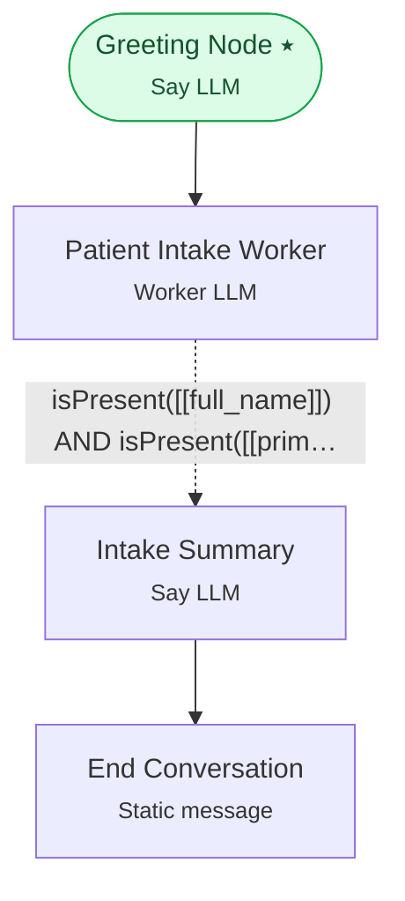

# Example 5 — Expression-based routing

> **Progressive curriculum · step 5 of 23.** Same intake flow, but route with the typed expression language instead of a freeform condition.

**Concepts introduced here:** condition_expression, isPresent([[var]]), [[runtime_variable]] references

| | |
|---|---|
| **Workflow name** | Example 5: Expression-Based Routing with Worker LLM |
| **Builder** | [`wf_example_progression_5.py`](./wf_example_progression_5.py) · `build_assistant_workflow()` |
| **Runnable notebook** | [`notebooks/wf_example_notebooks/wf_example_progression_5.ipynb`](../notebooks/wf_example_notebooks/wf_example_progression_5.ipynb) |
| **Nodes / edges** | 4 nodes, 3 edges |

## What it does

This workflow demonstrates Expression Language - a powerful, deterministic alternative to natural language conditions.
While Example 4 used human-readable freeform conditions, this example shows how to use programmatic expressions for precise, predictable routing based on structured data.
The workflow implements the same patient intake process, but uses expression language to make routing decisions based on exactly which fields have been filled and their specific values.

## Workflow diagram



*⭑ = start node · solid arrow = direct edge · dashed arrow = conditional edge (label = condition).*

## Nodes

| Node | Type | Role |
|---|---|---|
| Greeting Node | Say LLM | start |
| Patient Intake Worker | Worker LLM | waits for user, self-loops |
| Intake Summary | Say LLM | waits for user |
| End Conversation | Static message | — |

## Routing

| From | To | Edge | Condition |
|---|---|---|---|
| Greeting Node | Patient Intake Worker | direct | — |
| Patient Intake Worker | Intake Summary | conditional | `isPresent([[full_name]]) AND isPresent([[primary_complaint]])` |
| Intake Summary | End Conversation | direct | — |

## Dynamic variables

Seeded as `default_dynamic_variables` in the workflow's `miscellaneous`; override per run by passing `dynamic_variables=` to `arun`.

```json
{
  "greeting_phrase": "Hello and welcome!",
  "organization_name": "HealthFirst Medical Center",
  "emergency_number": "911",
  "high_urgency_response_time": "2 hours",
  "medium_urgency_response_time": "24 hours",
  "low_urgency_response_time": "48 hours",
  "closing_message": "Your health is our priority, and we're here to help.",
  "farewell_message": "Thank you for providing your information. We'll be in touch soon. Have a great day!"
}
```

## Run it

```bash
# Interactive, capped notebook (recommended — no input() needed):
pipenv run python notebooks/_run_e2e.py wf_example_progression_5

# Or open the notebook:
#   notebooks/wf_example_notebooks/wf_example_progression_5.ipynb

# Or the original interactive script (reads turns from stdin):
pipenv run python wf_examples/wf_example_progression_5.py
```

---
[← Example 4](./wf_example_progression_4.md) · [Curriculum index](./README.md) · [Example 6 →](./wf_example_progression_6.md)
