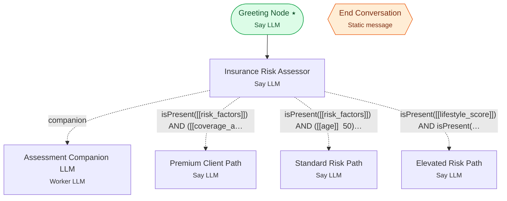

# Example 6 — Companion agents + multi-path routing

> **Progressive curriculum · step 6 of 23.** Pair a conversational agent with a silent companion extractor and branch to three risk paths.

**Concepts introduced here:** `CompanionEdgeConfig`, parallel Say + Worker agents, multi-branch expression routing

| | |
|---|---|
| **Workflow name** | Example 6: Insurance Risk Assessment with Advanced Conditional Branching |
| **Builder** | [`wf_example_progression_6.py`](./wf_example_progression_6.py) · `build_assistant_workflow()` |
| **Runnable notebook** | [`notebooks/wf_example_notebooks/wf_example_progression_6.ipynb`](../notebooks/wf_example_notebooks/wf_example_progression_6.ipynb) |
| **Nodes / edges** | 7 nodes, 5 edges |

## What it does

This workflow introduces Companion Edges - a powerful pattern that links a conversational Say LLM agent with a Worker LLM agent for parallel structured data extraction.
While the Say agent engages naturally with users, its companion Worker silently extracts structured data that can then drive sophisticated multi-path conditional routing.
This example demonstrates an insurance risk assessment workflow that collects applicant information and routes to three different care paths (Standard Risk, Premium Client, or Elevated Risk) based on complex expression-based conditions.

## Workflow diagram



*⭑ = start node · solid arrow = direct edge · dashed arrow = conditional edge (label = condition) · hexagon = **global node** (reachable from any node in the workflow).*

## Nodes

| Node | Type | Role |
|---|---|---|
| Greeting Node | Say LLM | start |
| Insurance Risk Assessor | Say LLM | waits for user, self-loops |
| Assessment Companion LLM | Worker LLM | — |
| Standard Risk Path | Say LLM | waits for user, self-loops |
| Elevated Risk Path | Say LLM | waits for user, self-loops |
| Premium Client Path | Say LLM | waits for user, self-loops |
| End Conversation | Static message | global |

## Routing

| From | To | Edge | Condition |
|---|---|---|---|
| Greeting Node | Insurance Risk Assessor | direct | — |
| Insurance Risk Assessor | Assessment Companion LLM | companion | — |
| Insurance Risk Assessor | Premium Client Path | conditional | `isPresent([[risk_factors]]) AND ([[coverage_amount]] >= 1000000) AND ([[age]] < 65) AND (…` |
| Insurance Risk Assessor | Standard Risk Path | conditional | `isPresent([[risk_factors]]) AND ([[age]] < 50) AND ([[coverage_amount]] < 500000) AND ([[…` |
| Insurance Risk Assessor | Elevated Risk Path | conditional | `isPresent([[lifestyle_score]]) AND isPresent([[coverage_amount]]) AND isPresent([[age]]) …` |

## Dynamic variables

Seeded as `default_dynamic_variables` in the workflow's `miscellaneous`; override per run by passing `dynamic_variables=` to `arun`.

```json
{
  "greeting_phrase": "Welcome to our Insurance Risk Assessment Portal!",
  "company_name": "Premier Insurance Group",
  "standard_quote_time": "24 hours",
  "standard_approval_time": "3-5 business days",
  "discount_program": "wellness",
  "premium_approval_time": "48 hours",
  "premium_contact_time": "4 business hours",
  "elevated_contact_time": "48 hours",
  "elevated_approval_time": "2-3 weeks",
  "farewell_message": "Thank you for your interest in our insurance services. We look forward to serving you. Have a great day!"
}
```

## Run it

```bash
# Interactive, capped notebook (recommended — no input() needed):
pipenv run python notebooks/_run_e2e.py wf_example_progression_6

# Or open the notebook:
#   notebooks/wf_example_notebooks/wf_example_progression_6.ipynb

# Or the original interactive script (reads turns from stdin):
pipenv run python wf_examples/wf_example_progression_6.py
```

---
[← Example 5](./wf_example_progression_5.md) · [Curriculum index](./README.md) · [Example 7 →](./wf_example_progression_7.md)
