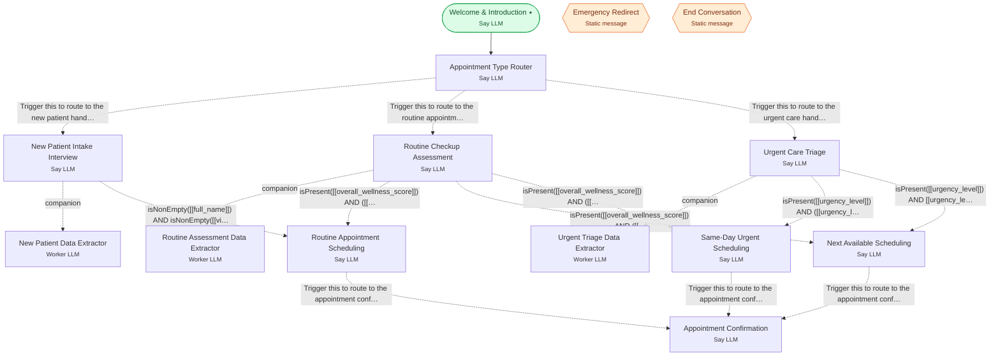

# Example 7 — Putting it together

> **Progressive curriculum · step 7 of 23.** A comprehensive front-desk agent: routing, intake, scheduling, confirmation, plus a global emergency and end node.

**Concepts introduced here:** composing many nodes/edges, multiple global nodes, larger real-world graph

| | |
|---|---|
| **Workflow name** | Example 7: Comprehensive Medical Appointment & Assessment Workflow |
| **Builder** | [`wf_example_progression_7.py`](./wf_example_progression_7.py) · `build_assistant_workflow()` |
| **Runnable notebook** | [`notebooks/wf_example_notebooks/wf_example_progression_7.ipynb`](../notebooks/wf_example_notebooks/wf_example_progression_7.ipynb) |
| **Nodes / edges** | 14 nodes, 16 edges |

## What it does

This workflow represents a more comprehensive example that combines all the concepts from Examples 1-6 into a medical appointment scheduling and assessment system.
It demonstrates how multiple agent types, edge types, structured data extraction patterns, and complex conditional routing work together in a real-world healthcare scenario.
The workflow handles new patient intake, routine checkups, urgent care triage, and emergency redirection with appropriate scheduling and follow-up.

## Workflow diagram



*⭑ = start node · solid arrow = direct edge · dashed arrow = conditional edge (label = condition) · hexagon = **global node** (reachable from any node in the workflow).*

## Nodes

| Node | Type | Role |
|---|---|---|
| Welcome & Introduction | Say LLM | start |
| Appointment Type Router | Say LLM | waits for user, self-loops |
| New Patient Intake Interview | Say LLM | waits for user, self-loops |
| New Patient Data Extractor | Worker LLM | — |
| Routine Checkup Assessment | Say LLM | waits for user, self-loops |
| Routine Assessment Data Extractor | Worker LLM | — |
| Urgent Care Triage | Say LLM | waits for user, self-loops |
| Urgent Triage Data Extractor | Worker LLM | — |
| Emergency Redirect | Static message | global |
| Same-Day Urgent Scheduling | Say LLM | waits for user, self-loops |
| Next Available Scheduling | Say LLM | waits for user, self-loops |
| Routine Appointment Scheduling | Say LLM | waits for user, self-loops |
| Appointment Confirmation | Say LLM | waits for user, self-loops |
| End Conversation | Static message | global |

## Routing

| From | To | Edge | Condition |
|---|---|---|---|
| Welcome & Introduction | Appointment Type Router | direct | — |
| Same-Day Urgent Scheduling | Appointment Confirmation | conditional | `Trigger this to route to the appointment confirmation agent after scheduling is complete.…` |
| Next Available Scheduling | Appointment Confirmation | conditional | `Trigger this to route to the appointment confirmation agent after scheduling is complete.…` |
| Routine Appointment Scheduling | Appointment Confirmation | conditional | `Trigger this to route to the appointment confirmation agent after scheduling is complete.…` |
| Appointment Type Router | New Patient Intake Interview | conditional | `Trigger this to route to the new patient handling agent when the patient explicitly state…` |
| Appointment Type Router | Routine Checkup Assessment | conditional | `Trigger this to route to the routine appointment handling agent when the patient wants a …` |
| Appointment Type Router | Urgent Care Triage | conditional | `Trigger this to route to the urgent care handling agent when the patient has urgent sympt…` |
| New Patient Intake Interview | New Patient Data Extractor | companion | — |
| Routine Checkup Assessment | Routine Assessment Data Extractor | companion | — |
| Urgent Care Triage | Urgent Triage Data Extractor | companion | — |
| New Patient Intake Interview | Routine Appointment Scheduling | conditional | `isNonEmpty([[full_name]]) AND isNonEmpty([[visit_reason]])` |
| Routine Checkup Assessment | Routine Appointment Scheduling | conditional | `isPresent([[overall_wellness_score]]) AND ([[overall_wellness_score]] >= 80)` |
| Routine Checkup Assessment | Next Available Scheduling | conditional | `isPresent([[overall_wellness_score]]) AND ([[overall_wellness_score]] < 80) AND ([[overal…` |
| Routine Checkup Assessment | Same-Day Urgent Scheduling | conditional | `isPresent([[overall_wellness_score]]) AND ([[overall_wellness_score]] < 50)` |
| Urgent Care Triage | Same-Day Urgent Scheduling | conditional | `isPresent([[urgency_level]]) AND ([[urgency_level]] == 'urgent' OR [[urgency_level]] == '…` |
| Urgent Care Triage | Next Available Scheduling | conditional | `isPresent([[urgency_level]]) AND [[urgency_level]] == 'routine'` |

## Dynamic variables

Seeded as `default_dynamic_variables` in the workflow's `miscellaneous`; override per run by passing `dynamic_variables=` to `arun`.

```json
{
  "clinic_name": "HealthFirst Medical Center",
  "clinic_address": "123 Wellness Way, Medical District",
  "greeting_phrase": "Welcome! I'm here to help you schedule your appointment.",
  "appointment_types": [
    "New Patient Visit",
    "Routine Checkup/Physical",
    "Urgent Care",
    "Follow-up Visit"
  ],
  "emergency_number": "911",
  "urgent_care_time_slots": [
    "10:30 AM",
    "2:00 PM",
    "4:15 PM"
  ],
  "next_available_slots": [
    "Tomorrow at 9:00 AM",
    "Tomorrow at 2:30 PM",
    "Day after tomorrow at 11:00 AM"
  ],
  "routine_available_slots": [
    "Next Monday 9:00 AM",
    "Next Wednesday 2:00 PM",
    "Next Friday 10:30 AM",
    "Following Monday 3:00 PM"
  ],
  "urgent_arrival_instruction": "15 minutes early to complete check-in",
  "standard_arrival_instruction": "10 minutes early for check-in",
  "routine_recommendation": "at least 2-3 weeks in advance for better availability",
  "confirmation_method": "via email and text message",
  "confirmation_closing": "We look forward to seeing you!",
  "farewell_message": "Thank you for choosing HealthFirst Medical Center. Your appointment is confirmed. We look forward to caring for you. Have a wonderful day!"
}
```

## Run it

```bash
# Interactive, capped notebook (recommended — no input() needed):
pipenv run python notebooks/_run_e2e.py wf_example_progression_7

# Or open the notebook:
#   notebooks/wf_example_notebooks/wf_example_progression_7.ipynb

# Or the original interactive script (reads turns from stdin):
pipenv run python wf_examples/wf_example_progression_7.py
```

---
[← Example 6](./wf_example_progression_6.md) · [Curriculum index](./README.md) · [Example 8 →](./wf_example_progression_8.md)
