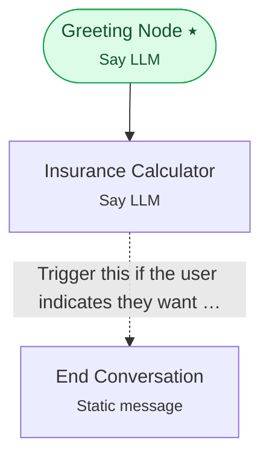

# Example 8 — Inline Python tools

> **Progressive curriculum · step 8 of 23.** Give an LLM callable Python tools to compute insurance quotes on demand.

**Concepts introduced here:** `InlinePythonToolConfig`, LLM-invoked tools, tool args_schema

| | |
|---|---|
| **Workflow name** | Example 8: Insurance Calculator with Inline Python Tools |
| **Builder** | [`wf_example_progression_8.py`](./wf_example_progression_8.py) · `build_assistant_workflow()` |
| **Runnable notebook** | [`notebooks/wf_example_notebooks/wf_example_progression_8.ipynb`](../notebooks/wf_example_notebooks/wf_example_progression_8.ipynb) |
| **Nodes / edges** | 3 nodes, 2 edges |

## What it does

This workflow introduces Tools - a powerful feature that allows you to equip LLMs with Tools.
For illustration purposes, we leverage Inline Python tools - a concept where custom Python functions can be defined directly within your workflow configuration without pre-registration.
These tools enable agents to perform calculations, data transformations, and business logic execution on demand.
The example demonstrates an insurance calculator assistant that uses multiple inline tools to calculate premiums, deductibles, eligibility, and cost estimates based on user inputs.

## Workflow diagram



*⭑ = start node · solid arrow = direct edge · dashed arrow = conditional edge (label = condition).*

## Nodes

| Node | Type | Role |
|---|---|---|
| Greeting Node | Say LLM | start |
| Insurance Calculator | Say LLM | waits for user, self-loops |
| End Conversation | Static message | — |

## Routing

| From | To | Edge | Condition |
|---|---|---|---|
| Greeting Node | Insurance Calculator | direct | — |
| Insurance Calculator | End Conversation | conditional | `Trigger this if the user indicates they want to end the conversation or says goodbye. Exa…` |

## Run it

```bash
# Interactive, capped notebook (recommended — no input() needed):
pipenv run python notebooks/_run_e2e.py wf_example_progression_8

# Or open the notebook:
#   notebooks/wf_example_notebooks/wf_example_progression_8.ipynb

# Or the original interactive script (reads turns from stdin):
pipenv run python wf_examples/wf_example_progression_8.py
```

---
[← Example 7](./wf_example_progression_7.md) · [Curriculum index](./README.md) · [Example 9 →](./wf_example_progression_9.md)
