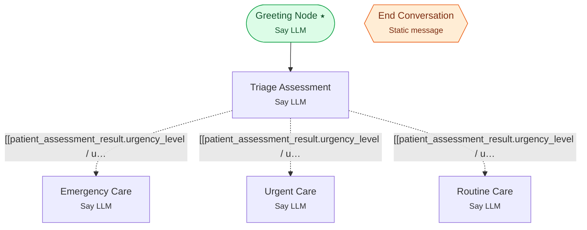

# Example 9 — Tools + runtime variables + branching

> **Progressive curriculum · step 9 of 23.** Run an assessment tool, store its result in a runtime variable, and branch on it.

**Concepts introduced here:** result_runtime_variable_name, runtime variables [[...]], branching on tool output, tool static messages

| | |
|---|---|
| **Workflow name** | Example 9: Patient Triage with Tool Static Messages and Runtime Variables |
| **Builder** | [`wf_example_progression_9.py`](./wf_example_progression_9.py) · `build_assistant_workflow()` |
| **Runnable notebook** | [`notebooks/wf_example_notebooks/wf_example_progression_9.ipynb`](../notebooks/wf_example_notebooks/wf_example_progression_9.ipynb) |
| **Nodes / edges** | 6 nodes, 4 edges |

## What it does

This workflow introduces two advanced features that enhance user experience and enable cross-node data flow: Tool Static Messages and Tool Result Runtime Variables.
Static messages provide user feedback during tool execution ("Analyzing your symptoms..."), while runtime variables store tool results for use in downstream agents.
The example demonstrates a patient triage workflow where symptom assessment results are stored and used by specialized care path agents.

## Workflow diagram



*⭑ = start node · solid arrow = direct edge · dashed arrow = conditional edge (label = condition) · hexagon = **global node** (reachable from any node in the workflow).*

## Nodes

| Node | Type | Role |
|---|---|---|
| Greeting Node | Say LLM | start |
| Triage Assessment | Say LLM | waits for user, self-loops |
| Emergency Care | Say LLM | — |
| Urgent Care | Say LLM | waits for user, self-loops |
| Routine Care | Say LLM | waits for user, self-loops |
| End Conversation | Static message | global |

## Routing

| From | To | Edge | Condition |
|---|---|---|---|
| Greeting Node | Triage Assessment | direct | — |
| Triage Assessment | Emergency Care | conditional | `[[patient_assessment_result.urgency_level / upcase ]] == 'EMERGENCY'` |
| Triage Assessment | Urgent Care | conditional | `[[patient_assessment_result.urgency_level / upcase ]] == 'URGENT'` |
| Triage Assessment | Routine Care | conditional | `[[patient_assessment_result.urgency_level / upcase ]] == 'ROUTINE'` |

## Run it

```bash
# Interactive, capped notebook (recommended — no input() needed):
pipenv run python notebooks/_run_e2e.py wf_example_progression_9

# Or open the notebook:
#   notebooks/wf_example_notebooks/wf_example_progression_9.ipynb

# Or the original interactive script (reads turns from stdin):
pipenv run python wf_examples/wf_example_progression_9.py
```

---
[← Example 8](./wf_example_progression_8.md) · [Curriculum index](./README.md) · [Example 10 →](./wf_example_progression_10.md)
